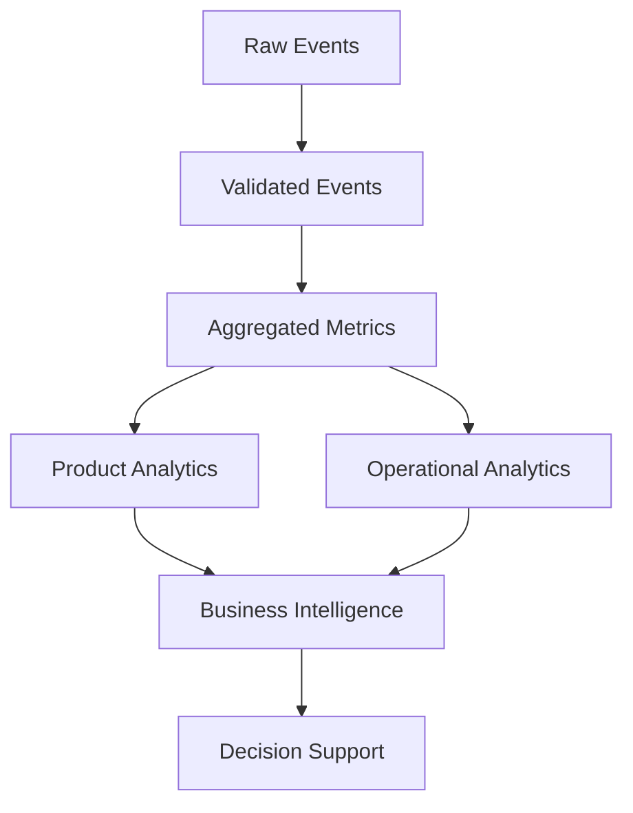
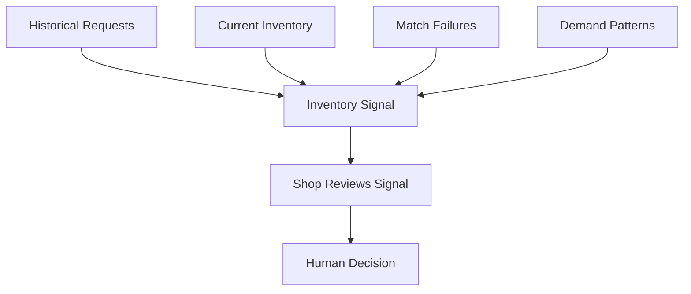
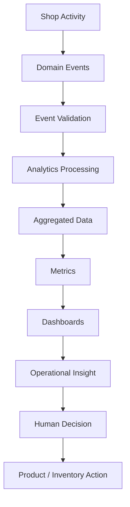

# SpareLink | Analytics, Product Intelligence & Decision Support

**Part 14 of the SpareLink MVP documentation**

> **SpareLink should learn from what happens across the network, but analytics should support human decisions rather than blindly make them.**

Part 14 continues directly from Parts 1–13 and defines the analytics, product intelligence, operational intelligence, reporting, demand analysis, inventory intelligence, and decision-support layer of SpareLink.

The objective is to transform platform activity into useful information without compromising privacy, security, or business confidentiality.

---

## 1. Part 14 Objective

Part 14 defines a complete analytics architecture covering:

- product analytics
- operational analytics
- business metrics
- platform metrics
- request analytics
- matching analytics
- inventory analytics
- fulfillment analytics
- supplier analytics
- AI analytics
- notification analytics
- reliability analytics
- demand analysis
- inventory intelligence
- trend detection
- dashboards
- reporting
- event tracking
- data pipelines
- analytical data models
- aggregation
- privacy
- access control
- retention
- data quality
- anomaly detection
- forecasting concepts
- decision support
- experimentation support
- analytics observability
- MVP priorities

The guiding question is:

> **What can SpareLink learn from the activity happening across the network?**

Analytics must support:

```text
Understanding
+
Measurement
+
Decision Support
+
Continuous Improvement
```

Analytics must not silently turn into automated business decisions without clearly defined rules and safeguards.

---

## 2. Core Analytics Philosophy

SpareLink follows:

```text
Collect Carefully
+
Measure Meaningfully
+
Protect Privacy
+
Separate Facts From Predictions
+
Make Metrics Reproducible
+
Support Human Decisions
+
Avoid Vanity Metrics
```

Do not track an event merely because it is technically easy.

Every analytics event should answer:

> **What decision or product improvement will this information support?**

A useful analytics system is not a chart factory. It is an evidence system.

---

## 3. Analytics Layers

The analytics architecture progresses through distinct layers:



### Raw Events

Low-level domain activity emitted by the platform.

### Validated Events

Events that satisfy the analytics event contract and required data-quality checks.

### Aggregated Metrics

Reusable calculations built from validated events.

### Product Analytics

Information about how users and shops interact with SpareLink.

### Operational Analytics

Information about platform health, workflow performance, and system behavior.

### Business Intelligence

Higher-level summaries, trends, and comparisons.

### Decision Support

Evidence presented to authorized humans so they can evaluate possible actions.

Transactional data remains authoritative for business state.

---

## 4. Event-Driven Analytics

Analytics should use meaningful domain events.

Potential event types include:

```text
USER_REGISTERED
SHOP_CREATED
SHOP_VERIFIED

INVENTORY_ADDED
INVENTORY_UPDATED
INVENTORY_REMOVED

REQUEST_CREATED
REQUEST_CONFIRMED
REQUEST_SEARCHED
MATCH_FOUND
MATCH_SELECTED

SUPPLIER_NOTIFIED
SUPPLIER_ACCEPTED
SUPPLIER_DECLINED

RESERVATION_CREATED
RESERVATION_CANCELLED

FULFILLMENT_STARTED
FULFILLMENT_COMPLETED

REQUEST_EXPIRED
NO_MATCH
ERROR_OCCURRED
```

The final event taxonomy should remain intentionally small and useful.

Do not create hundreds of event types merely to increase tracking volume.

---

## 5. Analytics Event Schema

A consistent event structure is required.

Example:

```json
{
  "event_name": "match_found",
  "event_id": "evt_123",
  "occurred_at": "timestamp",
  "request_id": "req_123",
  "shop_id": "shop_456",
  "actor_type": "shop",
  "application_version": "version",
  "metadata": {},
  "correlation_id": "corr_123"
}
```

Useful fields include:

| Field | Purpose |
|---|---|
| event_id | Unique event identity |
| event_name | Canonical event type |
| occurred_at | Event timestamp |
| request_id | Request lifecycle association where relevant |
| shop_id | Shop association where appropriate |
| actor_type | Type of actor producing the event |
| application_version | Version that produced the event |
| metadata | Limited context required for analytics |
| correlation_id | Cross-service lifecycle tracing |

Do not store unnecessary personal information.

---

## 6. Transactional vs Analytical Data

### Transactional Data

Transactional data operates SpareLink.

Examples:

```text
Inventory
Requests
Reservations
Shop Profiles
Users
Transactions
```

### Analytical Data

Analytical data helps understand SpareLink.

Examples:

```text
Aggregated Metrics
Trends
Historical Reports
Demand Patterns
System Performance
```

The two workloads should remain logically separated wherever practical so that expensive analytics queries do not interfere with critical transactions.

---

## 7. Analytics Data Pipeline

The MVP pipeline is:


The MVP should remain simple.

Do not introduce a large-scale warehouse or streaming platform solely for appearance.

---

## 8. MVP Analytics Architecture

A practical MVP approach is:

```text
SpareLink Backend
      ↓
Analytics Events
      ↓
PostgreSQL Analytics Tables
      ↓
SQL Aggregations
      ↓
Dashboard
```

### MVP

- core event tracking
- validated analytics events
- SQL aggregations
- canonical metrics
- basic shop dashboard
- basic platform dashboard

### P1

A separate analytical database or specialized pipeline may become appropriate when transaction volume, query cost, data retention, or operational complexity makes the MVP approach insufficient.

### P2

Advanced distributed analytics infrastructure can be introduced only when measured scale justifies it.

---

## 9. Product Analytics

Product analytics measures meaningful workflows.

```text
Registration
↓
Shop Setup
↓
Inventory Added
↓
Request Created
↓
Match Found
↓
Request Sent
↓
Accepted
↓
Reserved
↓
Completed
```

Potential metrics:

- active shops
- requests created
- requests completed
- match rate
- no-match rate
- reservation rate
- fulfillment completion rate
- repeat usage

These are metric definitions, not claims about actual results.

---

## 10. Funnel Analysis

Example product funnel:

```text
Registered Shop
↓
Completed Onboarding
↓
Added Inventory
↓
Created Request
↓
Received Match
↓
Sent Supplier Request
↓
Reservation
↓
Fulfillment
```

For each stage record:

```text
Entered
Completed
Dropped
Conversion Rate
```

A drop-off identifies where investigation may be useful.

Do not assume why users dropped off without evidence.

---

## 11. Request Analytics

Analyze requests by:

- shop
- part category
- urgency
- brand
- model
- geographic area
- time period
- success status
- failure status
- cancellation status

Operational systems may retain original request text where required, while analytical dashboards should avoid unnecessary exposure of raw text.

---

## 12. No-Match Analytics

“No Match” is a major product signal.

Track the reason rather than using one undifferentiated counter.

Possible categories:

```text
Part Not Found
Insufficient Quantity
Outside Radius
Inactive Shops
Unknown Part
Incompatible Inventory
Stale Inventory
No Participating Shop
```

This classification makes it possible to distinguish supply problems, data-quality problems, matching limitations, and network-coverage gaps.

---

## 13. Matching Analytics

Track:

- candidate count
- eligible candidates
- exact matches
- compatible matches
- final matches
- search radius
- radius expansion
- ranking latency
- selected match
- rejected match
- failed match

Possible metric:

```text
Match Success Rate
=
Successful Match Requests
/
Total Valid Search Requests
```

The denominator must be defined in the canonical metric dictionary.

Metric definitions must not change silently.

---

## 14. Match Quality Analytics

Do not equate “match found” with “successful fulfillment.”

Measure the full chain:

```text
Match Found
↓
Match Selected
↓
Supplier Accepts
↓
Inventory Confirmed
↓
Reservation
↓
Fulfillment
```

Useful measures include:

```text
Exact Match Rate
Compatible Match Rate
Inventory Mismatch Rate
Reservation Success Rate
Supplier Acceptance Rate
```

A useful match is one that survives the later workflow.

---

## 15. Inventory Analytics

Inventory intelligence should track:

- total inventory records
- available inventory
- low-stock inventory
- out-of-stock inventory
- inactive inventory
- stale inventory
- inventory update frequency
- inventory turnover where measurable
- requested but unavailable parts

Show how inventory changes over time.

Analytics should complement, not replace, transactional inventory truth.

---

## 16. Inventory Freshness

Measure how current inventory information is.

```text
Last Updated
↓
Age
↓
Fresh / Aging / Stale
```

Freshness thresholds should be configurable.

Do not describe inventory as “real-time” unless the underlying system actually guarantees the required freshness and propagation semantics.

---

## 17. Inventory Demand Gap

A useful signal occurs when:

```text
High Demand
+
Low Availability
```

Example:

```text
Part A
100 Requests
15 Successful Matches
85 No-Match / Unavailable
```

This indicates an observed demand gap.

It should not automatically produce a purchasing command.

Preferred decision-support output:

> “This part has frequently been requested but was unavailable in the observed network.”

The final stock decision belongs to the shop.

---

## 18. Demand Analytics

Analyze demand by:

- part
- category
- brand
- model
- geographic area
- time period
- urgency

Possible outputs:

```text
Frequently Requested Parts
Frequently Unavailable Parts
Emerging Demand
Seasonal Patterns
Local Demand Concentration
```

Exploratory patterns must be clearly distinguished from statistically validated trends.

---

## 19. Geographic Analytics

Measure network activity geographically.

Potential metrics:

- requests by area
- inventory density
- shop density
- match density
- no-match areas
- average search radius
- request-to-supplier distance

Protect location privacy.

Exact shop locations should not be exposed through analytics unless required and authorized.

---

## 20. Network Intelligence

A core SpareLink relationship is:

```text
Shop
↔
Part
↔
Request
↔
Supplier
```

Network analysis can identify:

- frequently connected shops
- frequently exchanged categories
- high-demand regions
- sparse inventory regions
- recurring shortage patterns

Network relationships should not automatically become public reputational judgments.

Governance and evidence are required before exposing comparative claims about businesses.

---

## 21. Supplier Analytics

Authorized shop users may need shop-level operational information.

Potential metrics:

- incoming requests
- accepted requests
- declined requests
- response time
- reservation completion
- cancellations
- inventory freshness
- fulfilled requests

These metrics should be accessible only to authorized users.

Measured operational information must remain distinct from broad reputation claims.

---

## 22. Shop Dashboard

A shopkeeper dashboard should emphasize action-relevant information.

Suggested structure:

```text
Today's Activity
↓
Open Requests
↓
Incoming Requests
↓
Inventory Status
↓
Demand Signals
↓
Recent Fulfillments
```

Useful cards include:

```text
Requests This Week
Matches Found
Parts Fulfilled
Low Stock Items
Stale Inventory Items
```

Avoid overwhelming shopkeepers with unnecessary data.

---

## 23. Platform / Admin Dashboard

A platform-level dashboard may contain:

```text
Platform Health
User & Shop Growth
Request Volume
Matching Performance
Fulfillment
Inventory Health
AI Performance
Notifications
Errors
Security Signals
```

Sensitive information remains access-controlled.

---

## 24. Operational Analytics

Operational analytics connects directly to the quality framework from Part 13.

Measure:

- API latency
- error rate
- database performance
- queue depth
- real-time connection health
- notification delivery
- AI failures
- reservation failures
- background-job failures

The same operational signals may be used for alerts, incident investigation, and reliability improvement.

---

## 25. AI Analytics

Track:

- AI requests
- successful structured outputs
- validation failures
- uncertain outputs
- user corrections
- AI processing latency
- AI provider errors
- token/cost usage where available
- manual fallback rate

Example metric:

```text
User Correction Rate
=
Requests Where User Edited AI Output
/
AI-Assisted Requests
```

A low correction rate does not prove perfect AI accuracy.

Part 13 remains the authority for AI evaluation methodology.

---

## 26. AI Error Analysis

Create categories:

```text
Correct
Partially Correct
Incorrect
Uncertain
Unsafe Assumption
Technical Failure
```

Analyze examples to identify systematic issues.

Production AI behavior must not silently change from analytics observations alone. Any model, prompt, or policy change requires explicit evaluation and deployment controls.

---

## 27. Notification Analytics

Track:

- notification created
- notification delivered
- notification failed
- delivery latency
- duplicate notification
- user preference
- channel used

Possible channels:

```text
In-App
Push
WhatsApp
```

A sent notification is not necessarily a received notification, and receipt is not the same as user action.

---

## 28. Fulfillment Analytics

Measure the business workflow:

```text
Request
↓
Match
↓
Acceptance
↓
Reservation
↓
Handover
↓
Completion
```

Useful metrics:

- reservation success
- fulfillment completion
- cancellation
- expiration
- failure reason
- time between state transitions

This identifies where requests succeed or fail in the real workflow.

---

## 29. Time-Based Analytics

Analyze:

- hourly patterns
- daily patterns
- weekly patterns
- monthly trends

Examples:

```text
Requests by Hour
Requests by Day
No-Match Rate by Day
Average Fulfillment Time
```

Insufficient data must not be presented as seasonality.

---

## 30. Cohort Analysis

Define shop cohorts by an explicit boundary, such as joining period:

```text
Shops Joining in Month 1
Shops Joining in Month 2
Shops Joining in Month 3
```

Analyze:

- onboarding completion
- first request
- repeat requests
- fulfillment usage
- retention

Observation windows must be consistent.

---

## 31. Retention Analytics

Possible retention views:

```text
D7
D30
Monthly
```

Retention should reflect meaningful product use.

Example:

```text
Shop Joins
↓
Uses SpareLink
↓
Returns Later
↓
Creates Another Meaningful Request
```

Merely opening the application should not automatically be treated as meaningful retention.

---

## 32. Experimentation Analytics

SpareLink can evaluate changes such as:

- onboarding flow
- search UI
- request confirmation wording
- notification timing
- dashboard layout

For every experiment define:

```text
Hypothesis
Control
Variant
Primary Metric
Guardrail Metrics
Observation Window
Decision Rule
```

Do not claim causal impact without a suitable experimental design.

---

## 33. Guardrail Metrics

Every experiment should monitor quality and safety.

Example:

```text
Primary Goal:
Increase completed requests

Guardrails:
Error Rate
Cancellation Rate
Inventory Mismatch Rate
Support Issues
```

Improvement in a single metric is not sufficient if critical quality worsens elsewhere.

---

## 34. Anomaly Detection

Detect possible anomalies such as:

- sudden request spikes
- abnormal no-match rates
- sudden inventory changes
- notification failure spikes
- AI failure spikes
- reservation failure spikes
- unusual authentication activity

Start with simple threshold-based detection in the MVP.

Advanced statistical methods can remain future scope.

---

## 35. Data Quality Monitoring

Analytics are trustworthy only when the underlying data is trustworthy.

Check:

```text
Missing Values
Duplicate Events
Invalid IDs
Impossible Timestamps
Invalid Statuses
Unexpected Categories
Broken Relationships
```

Track data-quality failures separately so that analytical errors are visible rather than silently folded into dashboards.

---

## 36. Canonical Metric Dictionary

Every important metric should have one authoritative definition.

Define:

```text
Metric Name
Definition
Formula
Source Events
Time Window
Filters
Owner
Update Frequency
```

Example:

```text
Metric:
Match Rate

Definition:
Percentage of valid searches producing at least one eligible match.

Formula:
Searches with eligible match
/
Valid searches
```

The dictionary prevents different dashboards from calculating the same metric differently.

---

## 37. Dashboard Design Principles

Dashboards should follow:

```text
Overview
↓
Key Signal
↓
Trend
↓
Breakdown
↓
Action
```

Avoid:

- unnecessary charts
- decorative metrics
- duplicated information
- unreadable tables
- unexplained percentages

Every chart should answer a meaningful question.

---

## 38. Analytics Visualization Types

Choose visualizations according to the analytical question.

### Trend

Line chart.

### Category Comparison

Bar chart.

### Geographic Distribution

Map where appropriate.

### Funnel

Funnel visualization.

### Composition

Stacked bars or another suitable proportion chart.

### Operational Status

Tables or status cards.

Do not use a chart merely because it looks impressive.

---

## 39. Privacy-Preserving Analytics

Analytics should minimize sensitive information.

Avoid unnecessary collection of:

- phone numbers
- private addresses
- authentication tokens
- exact personal locations
- private messages

Prefer:

```text
Aggregated Data
+
Pseudonymous Identifiers
+
Limited Access
```

where practical.

Analytics must remain consistent with the privacy and trust model from Part 12.

---

## 40. Access Control for Analytics

Define role-based analytics access.

```text
Shop User
↓
Own Shop Analytics

Platform Admin
↓
Platform Analytics

Developer
↓
Technical Metrics Only

Support Role
↓
Limited Operational Metrics
```

A user must not gain cross-shop business intelligence simply by changing an API identifier or dashboard parameter.

---

## 41. Data Retention

Separate retention decisions for:

```text
Raw Events
Aggregated Data
Operational Logs
Audit Data
```

Retention should consider:

- business need
- privacy requirements
- legal requirements
- security requirements
- operational value

Do not retain everything forever by default.

---

## 42. Analytics Security

Protect:

- dashboard authentication
- analytics APIs
- analytics queries
- exports
- reports
- stored analytical data
- event pipelines

Test:

```text
Unauthorized Dashboard Access
Cross-Shop Data Access
Export Abuse
Data Leakage
```

Analytics systems are security-sensitive because they may aggregate information that is less sensitive individually but highly revealing in combination.

---

## 43. Reporting

Reports should use canonical metrics.

### Shop Report

```text
Requests
Matches
Fulfillments
Inventory Health
Demand Signals
```

### Platform Report

```text
Network Growth
Matching
Fulfillment
Reliability
AI
Security Signals
```

Recurring reports should have clear ownership and update schedules.

---

## 44. Safe Exports

Potential export formats:

```text
CSV
JSON
PDF
```

Exports should:

- require authorization
- log export events where appropriate
- minimize sensitive fields
- have reasonable limits

Dashboard access does not automatically mean unrestricted raw-data export.

---

## 45. Decision Support

Analytics should help answer:

```text
What parts are frequently requested?
Where are shortages occurring?
Which inventory records are stale?
Where is matching failing?
Which workflows have high drop-off?
What operational issue needs attention?
```

The system should present evidence and context.

It should not pretend that analytics automatically knows the correct business decision.

---

## 46. Inventory Recommendation Signals

A future inventory intelligence workflow can be:



Example:

> “Samsung M14 displays were frequently requested in the observed network and were often unavailable.”

This is a signal, not an automatic purchasing command.

---

## 47. Demand Forecasting

Forecasting should remain future scope unless the MVP genuinely requires it.

Potential inputs:

- historical requests
- seasonality
- regional trends
- inventory availability
- fulfillment history

Potential outputs:

```text
Expected Demand Range
Confidence
Supporting Evidence
```

Uncertain forecasts must be displayed as uncertain.

Forecast accuracy requires measured evaluation over an appropriate dataset and observation window.

---

## 48. Business Intelligence vs Prediction

Clearly distinguish:

### Observed

```text
100 requests were recorded.
```

### Derived

```text
No-match rate was 35%.
```

### Predicted

```text
Demand may increase next month.
```

The UI should make these categories visually and semantically distinct.

---

## 49. Analytics Alerts

Useful alerts may include:

```text
No-Match Rate Spike
Inventory Freshness Drop
Reservation Failure Spike
AI Validation Failure Spike
Notification Failure Spike
Unusual Request Volume
```

Each alert should define:

```text
Threshold
Detection
Notification
Suggested Investigation
```

Alert design should avoid fatigue.

---

## 50. Analytics API

Possible dashboard APIs:

```text
GET /analytics/shop/overview
GET /analytics/shop/inventory
GET /analytics/shop/requests

GET /analytics/platform/overview
GET /analytics/platform/matching
GET /analytics/platform/fulfillment
```

For each endpoint define:

```text
Authentication
Authorization
Filters
Time Range
Response
Error Conditions
```

These APIs must remain consistent with the backend architecture defined in earlier parts.

---

## 51. Analytics Query Safety

Analytics queries should avoid interfering with transactional workloads.

Use:

```text
Read-Only Access
+
Query Limits
+
Pagination
+
Aggregations
+
Timeouts
```

Where scale requires it, a separate analytical database or read replica can be considered.

---

## 52. Analytics Performance

Measure:

- dashboard load time
- query execution time
- aggregation latency
- export generation time
- event-processing latency

Avoid expensive analytical queries directly against critical transactional tables without understanding their impact.

---

## 53. Analytics Testing

Part 14 connects directly to Part 13.

Test:

- event generation
- event schema validation
- duplicate event handling
- missing events
- incorrect events
- metric calculations
- dashboard authorization
- data freshness
- aggregation correctness
- report generation
- privacy protection

Example:

```text
Request Created
↓
Event Generated
↓
Analytics Store
↓
Daily Request Count
```

The final count should reconcile with the canonical transactional source for the same scope and period.

---

## 54. Analytics Reconciliation

Periodically compare:

```text
Transactional Source
        vs
Analytical Data
```

Example:

```text
Database:
1,000 completed requests

Analytics:
997 completed requests
```

The discrepancy should trigger investigation.

Analytics should not silently become a second, conflicting version of business truth.

---

## 55. Data Lineage

For important metrics, document:

```text
Source
↓
Transformation
↓
Aggregation
↓
Dashboard
```

Example:

```text
REQUEST_COMPLETED
↓
Daily Aggregation
↓
Fulfillment Count
↓
Shop Dashboard
```

Data lineage makes analytics auditable, maintainable, and easier to debug.

---

## 56. Analytics Observability

Monitor the analytics system itself.

Track:

- event-ingestion failures
- processing lag
- duplicate events
- dropped events
- aggregation failures
- dashboard errors
- stale datasets
- query latency

The analytics layer must not become a silent black box.

---

## 57. MVP vs Future Analytics

### MVP

```text
Core Event Tracking
+
Request Metrics
+
Matching Metrics
+
Fulfillment Metrics
+
Inventory Health
+
Basic Shop Dashboard
+
Basic Admin Dashboard
+
Metric Definitions
```

### P1

```text
Advanced Demand Analysis
+
Cohort Analytics
+
Experimentation
+
Anomaly Detection
+
Inventory Intelligence
```

### P2

```text
Forecasting
+
Advanced ML
+
Network Optimization
+
Predictive Inventory
+
Advanced Decision Support
```

Do not build P2 analytics before reliable underlying data exists.

---

## 58. Analytics Maturity Model

SpareLink can mature through five analytical questions:

```text
Level 1
What happened?
        ↓
Level 2
Why did it happen?
        ↓
Level 3
What is changing?
        ↓
Level 4
What might happen next?
        ↓
Level 5
What action could be considered?
```

The system should progress gradually.

---

## 59. Complete Analytics Flow



Where prediction exists:

```text
Historical Data
↓
Model / Forecast
↓
Prediction
↓
Confidence / Evidence
↓
Human Review
```

---

## 60. End-to-End Example

Suppose multiple repair shops repeatedly request Samsung M14 displays.

Analytics may detect:

```text
High Request Volume
+
Frequent Unavailable Inventory
+
Repeated No-Match Events
```

The dashboard can surface:

```text
Frequently Requested
+
Frequently Unavailable
```

A shop owner then reviews the evidence and decides whether additional stock may be useful.

The analytics system does not guarantee that the resulting inventory decision will be profitable.

---

## 61. Product Improvement Loop

Analytics should feed product development:


This connects directly with the testing and validation loop defined in Part 13.

---

## 62. Success Measurement

The analytics layer succeeds when it provides:

```text
Accurate Metrics
+
Timely Information
+
Useful Insights
+
Correct Access Control
+
Reliable Data
+
Actionable Visibility
```

Success is not measured merely by the number of charts created.

---

## 63. Definition of Done

Part 14 is complete when the project has defined:

- analytics architecture
- event taxonomy
- event schema
- transactional vs analytical data
- analytics pipeline
- product analytics
- request analytics
- no-match analytics
- matching analytics
- inventory analytics
- inventory freshness
- geographic analytics
- supplier analytics
- AI analytics
- notification analytics
- fulfillment analytics
- funnel analytics
- cohort analytics
- retention analytics
- experimentation analytics
- anomaly detection
- data-quality monitoring
- canonical metric dictionary
- dashboard architecture
- shop dashboard
- platform dashboard
- privacy controls
- analytics access control
- retention policy
- reporting
- safe exports
- decision support
- inventory intelligence
- forecasting scope
- analytics APIs
- analytics testing
- reconciliation
- data lineage
- analytics observability
- MVP / P1 / P2 priorities

As with Part 13, **defined does not mean executed**. Actual analytical quality must be demonstrated with real implementation evidence.

---

## 64. Connection to Part 15

Part 15 should continue from the analytics and product-intelligence foundation and define:

- scalability
- architecture evolution
- network expansion
- advanced AI capabilities
- ecosystem integrations
- regional expansion
- long-term platform roadmap

Parts 1–14 now define:

```text
What SpareLink Is
↓
Who Uses It
↓
How Users Interact
↓
How the System Is Built
↓
How AI Understands Requests
↓
How Matching Works
↓
How Fulfillment Works
↓
How the Platform Is Deployed
↓
How the Platform Is Secured
↓
How the System Is Tested
↓
How the Platform Learns From Activity
```

Part 15 should answer:

> **How does SpareLink evolve from an MVP into a larger platform without losing its original simplicity?**

The progression should be:

```text
MVP
↓
Validated Product
↓
Growing Network
↓
Scaled Platform
↓
Advanced Intelligence
```

Do not jump directly to an unrealistic enterprise architecture.

---

# Final Principle

SpareLink should not become a dashboard factory.

Analytics exists to answer:

> **What is happening?**

Then:

> **Why is it happening?**

Then:

> **What pattern should we pay attention to?**

And finally:

> **What information would help a person make a better decision?**

The system must preserve the distinction between:

```text
Observed Fact
+
Derived Metric
+
Pattern
+
Prediction
+
Decision
```

These are not the same thing.

The final analytics loop is:

```text
Activity
↓
Evidence
↓
Insight
↓
Human Decision
↓
Action
↓
Measurement
```

That closes the SpareLink intelligence loop.

---

## Documentation Status

**Part:** 14  
**Title:** Analytics, Product Intelligence & Decision Support  
**Repository:** `bharath20865/sparelink`  
**Document Path:** `docs/14-analytics-product-intelligence-decision-support.md`  
**Implementation Status:** Architecture defined; execution and measured production results are not claimed  
**Next Part:** Part 15 — Scalability, Architecture Evolution & Long-Term Platform Roadmap
