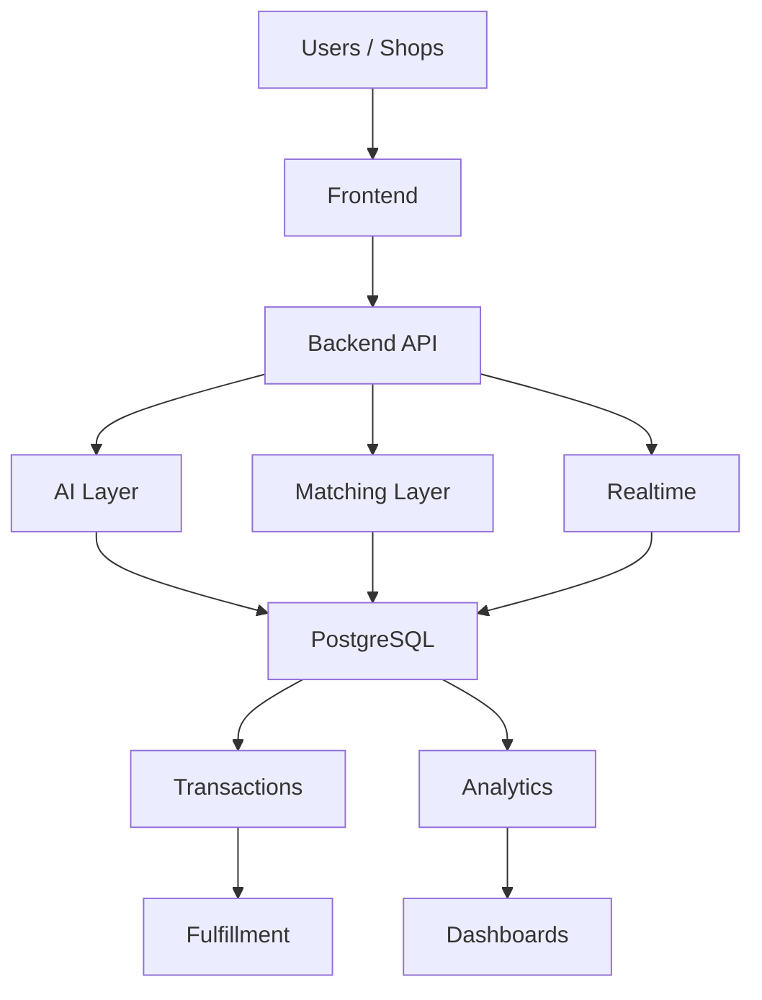
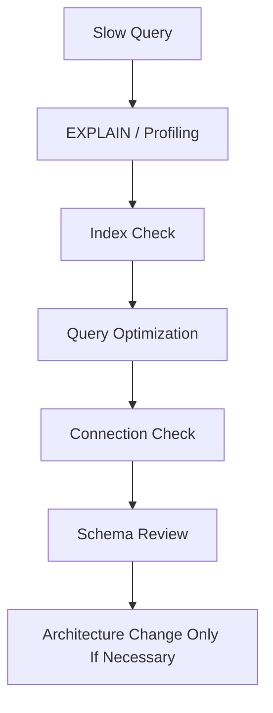
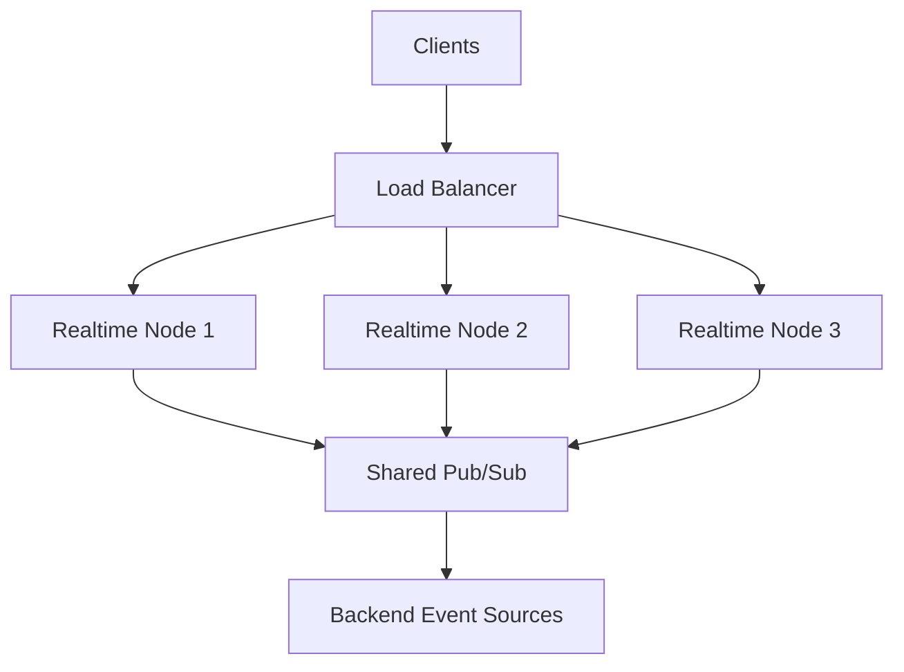
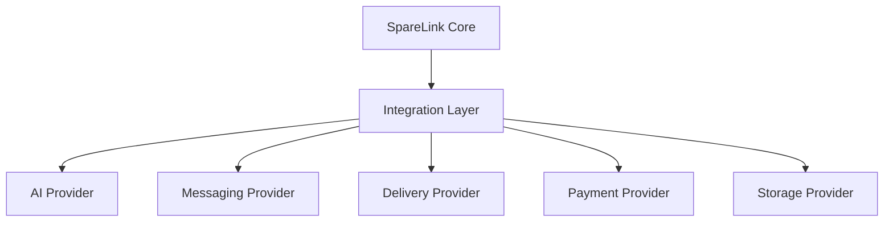
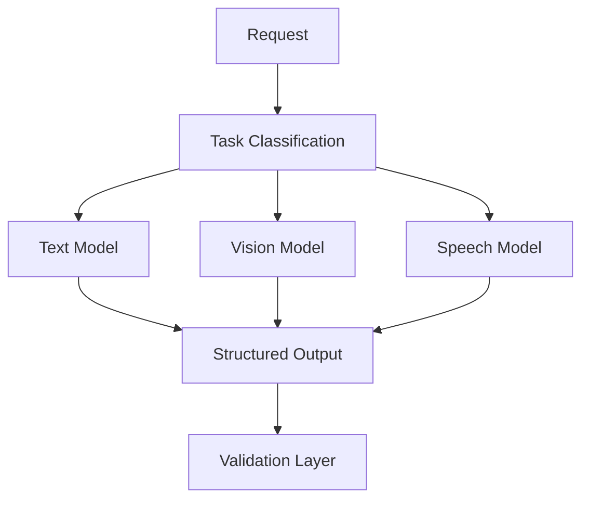
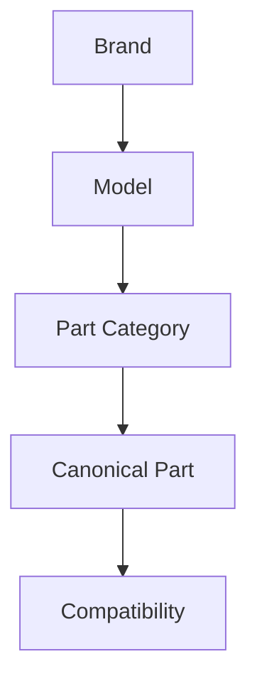
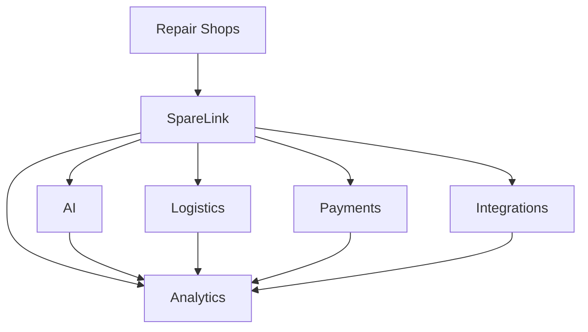
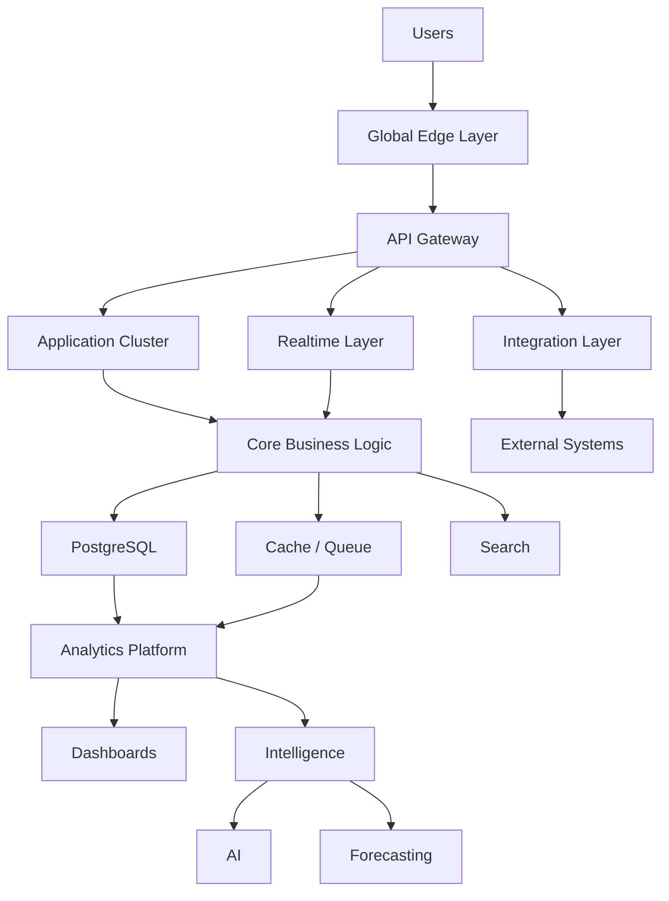

# SpareLink | Scalability, Platform Evolution, Advanced AI & Long-Term Roadmap

**Part 15 of the SpareLink MVP documentation**

> **Scale the architecture only when the product, traffic, data, and business requirements justify it.**

Part 15 continues directly from Parts 1–14 and defines how SpareLink can evolve from a student/hackathon MVP into a reliable, scalable, intelligent platform without unnecessarily increasing architectural complexity.

The intended evolution is:

```text
MVP
↓
Validated Product
↓
Growing Network
↓
Scaled Platform
↓
Advanced Intelligence
↓
Ecosystem
```

The architecture must evolve because evidence requires it, not because a technology looks impressive.

---

## 1. Part 15 Objective

Part 15 covers:

- scalability and scaling strategy
- application, database, API, realtime, search, and geospatial scaling
- caching and background processing
- queues and asynchronous workers
- matching-engine evolution
- network growth and regional expansion
- internationalization and multilingual support
- WhatsApp, delivery, payment, and partner integrations
- provider abstraction
- advanced AI, model routing, cost optimization, and fallback
- analytics and data-platform evolution
- observability and reliability maturity
- disaster recovery and security evolution
- platform governance
- technical debt and ADRs
- migration strategy and feature maturity
- modular monolith evolution and selective service extraction
- multi-tenant evolution
- developer experience and documentation
- cost-aware architecture and platform economics
- API and webhook platforms
- global part catalog and compatibility intelligence
- smart inventory evolution
- roadmap priorities and long-term architecture

---

## 2. Evolution Philosophy

SpareLink should follow:

```text
Simple First
+
Measure
+
Validate
+
Identify Bottleneck
+
Scale the Bottleneck
+
Measure Again
```

A major architectural change must answer:

> **What problem does this solve that the current architecture cannot reasonably solve?**

Do not adopt technology merely because:

```text
It is popular
+
It looks advanced
+
It sounds impressive
```

---

## 3. Current MVP Baseline

Parts 1–14 establish the current conceptual baseline:



This represents the MVP direction. Some future components described in this part are intentionally not part of the current implementation.

The distinction between **Current**, **Planned**, **Experimental**, and **Future** must be maintained throughout the roadmap.

---

## 4. Scalability Principles

SpareLink may need to scale across:

```text
Users
+
Shops
+
Requests
+
Inventory Records
+
AI Requests
+
Realtime Connections
+
Notifications
+
Analytics Events
```

### Vertical Scaling

```text
More CPU
+
More RAM
+
Faster Storage
```

Useful when a workload can be handled effectively by a larger instance.

### Horizontal Scaling

```text
Multiple Application Instances
```

Useful when traffic can be distributed across independent instances.

The simplest workable strategy should be preferred.

---

## 5. Scaling Triggers

Do not define scaling only by arbitrary user counts.

Monitor evidence such as:

- sustained CPU utilization
- memory pressure
- database CPU
- database connections
- query latency
- API latency
- request volume
- queue depth
- realtime connection count
- AI latency
- analytics processing lag

```text
Metric
↓
Threshold Exceeded
↓
Identify Bottleneck
↓
Scale Relevant Component
↓
Measure Again
```

Thresholds are engineering configuration, not universal industry values.

---

## 6. Application Scaling

The backend can evolve from:

```text
Single Backend Instance
```

to:

```text
Load Balancer
      │
  ┌───┼───┐
  ▼   ▼   ▼
 API API API
```

Application instances should be as stateless as practical.

Critical session state must not exist only in one server's local memory.

Shared storage, shared session infrastructure where required, and centralized observability become more important as instances multiply.

---

## 7. Database Scaling

Use the progression:

```text
Single PostgreSQL
↓
Optimized PostgreSQL
↓
Read Replica
↓
Partitioning Where Justified
↓
Distributed / Specialized Architecture
Only When Necessary
```

Priorities include:

- indexing
- query optimization
- connection pooling
- transaction management
- read replicas
- partitioning
- archival
- routine maintenance

Do not introduce sharding until measured scale makes simpler strategies insufficient.

---

## 8. Database Bottleneck Analysis

Before changing database architecture:



The simplest effective optimization should be attempted first.

---

## 9. Caching Strategy

Potential caching candidates include:

- shop profiles
- frequently accessed part metadata
- search metadata
- configuration
- analytics summaries
- static content

Dynamic inventory should not be cached blindly.

A cache design should define:

```text
Cache
+
TTL
+
Invalidation
+
Fallback
```

Caching must never make stale inventory appear to be confirmed availability.

---

## 10. Background Processing

Move suitable work out of synchronous API requests.

Potential jobs:

```text
Image Processing
Notification Delivery
Analytics Processing
Large Exports
Periodic Cleanup
Inventory Freshness Jobs
Report Generation
```

Architecture:

```text
API Request
↓
Background Job
↓
Worker
↓
Result / Event
```

The synchronous response should remain focused on work required to complete the immediate request.

---

## 11. Queue Architecture

A queue becomes useful when tasks need asynchronous execution, retries, buffering, or workload isolation.

Possible future structure:

```text
Backend
  │
  ▼
Queue
  ├── Notification Worker
  ├── Analytics Worker
  ├── AI Worker
  └── Maintenance Worker
```

Define:

- retries
- dead-letter handling
- idempotency
- job visibility
- failure handling

Avoid introducing multiple queue technologies without a clear operational reason.

---

## 12. Realtime Scaling

Initial direction:

```text
Frontend
↓
Realtime Server
↓
Backend
```

At greater scale:



Shared event distribution becomes useful when more than one realtime server must observe the same event stream.

Private events must remain authorized at every stage.

---

## 13. Search Scaling

The MVP may use PostgreSQL search.

Evolution:

```text
PostgreSQL Search
↓
Optimized Indexes
↓
Full-Text / Geospatial Optimization
↓
Dedicated Search Engine if Justified
```

A dedicated search system should be introduced only after measurement identifies a real limitation.

---

## 14. Geospatial Scaling

SpareLink depends on location-aware matching.

Support:

- geographic filtering
- radius searches
- distance calculations
- area clustering
- regional searches

Prefer database-native geospatial capabilities where practical before adding another platform.

Location precision and exposure must remain consistent with Part 12 privacy controls.

---

## 15. Matching Engine Evolution

Matching can evolve through:

```text
Deterministic Matching
↓
Better Compatibility Data
↓
Freshness Signals
↓
Reliability Signals
↓
Learning-Assisted Ranking
↓
Advanced Network Intelligence
```

Machine learning must never bypass:

- inventory validation
- authorization
- reservation safety
- backend state rules

---

## 16. Advanced Matching

Future ranking signals could include:

```text
Exact Compatibility
+
Availability
+
Distance
+
Freshness
+
Response History
+
Reliability
+
Urgency
```

The ranking system should remain explainable.

Any learned ranking must be evaluated against the deterministic baseline before adoption.

---

## 17. Network Effects

The product hypothesis is:

```text
More Shops
↓
More Inventory
↓
More Potential Matches
↓
More Successful Fulfillment
↓
More Shop Value
↓
More Shops
```

This is a hypothesis, not a guaranteed business outcome.

Part 14 analytics should provide the evidence required to evaluate whether network utility is actually improving.

---

## 18. Network Density

Track:

```text
Shop Density
Inventory Density
Request Density
Match Density
```

Registration count alone is insufficient.

A region may have many registered shops but weak utility if the relevant parts are unavailable.

Measure actual network utility.

---

## 19. Regional Expansion

A staged approach is:

```text
One Local Area
↓
Multiple Nearby Areas
↓
City
↓
Multiple Cities
↓
Region
↓
Country
↓
International
```

Each stage should validate:

- network density
- operational complexity
- support requirements
- search behavior
- language requirements
- regulatory requirements
- infrastructure needs

Expansion is evidence-led rather than calendar-led.

---

## 20. Multi-Region Architecture

Multi-region is future scope unless justified by actual requirements.

Potential structure:

```text
Region A
Region B
Region C
    ↓
Global Routing Layer
```

Consider:

- regional databases
- data residency
- latency
- replication
- failover
- consistency
- disaster recovery

Do not assume the MVP needs multi-region deployment.

---

## 21. Internationalization

Future support may include:

- multiple languages
- localized dates
- localized currencies
- regional addresses
- language-aware AI
- localized notifications

Separate:

```text
User Language
vs
Internal Canonical Representation
```

Example:

```text
Telugu / Hindi / English / Hinglish
↓
Normalized Internal Representation
↓
Matching Engine
```

Perfect multilingual AI behavior must never be assumed without evaluation.

---

## 22. WhatsApp Ecosystem

Future channel architecture:

```text
Shopkeeper
↓
WhatsApp
↓
SpareLink Integration Layer
↓
Request Parsing
↓
Confirmation
↓
Matching
↓
Supplier Notification
```

WhatsApp is a channel.

It is not the core source of business truth.

The SpareLink backend remains authoritative.

---

## 23. Delivery Integration

Optional delivery coordination can follow:

```text
Request Fulfilled
↓
Delivery Required
↓
Provider Selection
↓
Pickup
↓
Transit
↓
Delivery
↓
Completion
```

Keep the integration modular.

SpareLink should not become tightly coupled to one logistics provider.

---

## 24. Payment Boundaries

Future payment flow:

```text
Reservation
↓
Payment Service
↓
Payment Status
↓
Fulfillment
```

Payment state must remain separate from inventory state.

A payment provider response must not mutate inventory without backend validation and authorization.

---

## 25. External Integration Layer

Future integrations can connect through a modular layer:



External providers should be replaceable where practical.

---

## 26. Provider Abstraction

Stable internal interfaces may include:

```text
AIProvider
NotificationProvider
StorageProvider
PaymentProvider
DeliveryProvider
```

Core business logic should depend on internal contracts instead of spreading provider-specific behavior across the application.

---

## 27. Advanced AI Evolution

AI maturity can progress as:

```text
Stage 1
Request Understanding
↓
Stage 2
Multimodal Understanding
↓
Stage 3
Compatibility Assistance
↓
Stage 4
Context-Aware Assistance
↓
Stage 5
Network Intelligence
```

AI remains assistive and bounded by deterministic business rules.

---

## 28. Model Routing

Future multi-model architecture:



Provider and model selection should be configurable.

---

## 29. AI Cost Optimization

Measure:

- requests per day
- token usage where applicable
- average AI cost
- image-processing cost
- model latency
- fallback frequency

Possible strategies:

```text
Caching
+
Smaller Models for Simple Tasks
+
Routing
+
Input Reduction
+
Batch Processing
+
Manual Fallback
```

Cost optimization must not sacrifice critical correctness.

---

## 30. AI Fallback Architecture

```text
Primary AI
↓
Failure / Timeout
↓
Fallback AI
↓
Failure Again
↓
Manual Input
```

The final business action still passes:

```text
Schema Validation
+
Business Validation
+
Authorization
+
Transactional Backend Controls
```

---

## 31. Advanced Analytics Evolution

Part 14 can progress through:

```text
Basic Metrics
↓
Operational Analytics
↓
Cohort Analytics
↓
Demand Intelligence
↓
Forecasting
↓
Advanced Network Intelligence
```

Reliable historical data must come before advanced machine learning.

---

## 32. Data Platform Evolution

Possible progression:

```text
PostgreSQL Analytics
↓
Read Replica
↓
Analytical Database
↓
Data Warehouse / Lake
```

Move forward only when justified by:

- data volume
- query performance
- analytical complexity
- operational isolation

---

## 33. Observability Evolution

Current maturity may begin with:

```text
Logs
+
Metrics
+
Health Checks
```

Future maturity:

```text
Logs
+
Metrics
+
Distributed Tracing
+
Alerting
+
SLOs
+
Synthetic Monitoring
```

As distribution increases, tracing and correlation become more valuable for diagnosing failures.

---

## 34. Service-Level Concepts

Define:

- **SLI**: a measured service indicator
- **SLO**: a target level for an SLI
- **SLA**: a formal commitment, usually with an external or contractual context

Potential indicators:

```text
Availability
Latency
Error Rate
Recovery Time
```

Do not invent production commitments.

Example targets remain hypothetical until explicitly adopted and measured.

---

## 35. Disaster Recovery Evolution

Progression:

```text
Backups
↓
Verified Restores
↓
Automated Recovery
↓
Failover
↓
Regional Recovery
```

Measure:

- **RTO**: Recovery Time Objective
- **RPO**: Recovery Point Objective

RTO describes how quickly service should be restored after a defined failure scenario.

RPO describes how much recent data loss is acceptable for a defined recovery scenario.

These are design concepts unless specific project objectives are formally adopted.

---

## 36. Security Evolution

Extend Part 12 through:

```text
Basic Security
↓
Automated Security Testing
↓
Dependency Scanning
↓
Secrets Management
↓
Continuous Monitoring
↓
Advanced Threat Detection
```

Security maturity should increase alongside platform complexity.

---

## 37. Platform Governance

Future governance covers:

- account verification
- shop verification
- abuse handling
- disputes
- moderation
- data access
- auditability
- API usage
- partner integrations
- marketplace rules

Governance rules should be documented, reviewable, and transparent to affected users where appropriate.

---

## 38. Technical Debt Management

For every technical-debt item:

```text
Problem
Impact
Risk
Temporary Workaround
Recommended Fix
Priority
```

A growing codebase should not automatically become a growing pile of hidden exceptions.

---

## 39. Architecture Decision Records

Major architectural decisions should use ADRs.

Recommended format:

```text
Title
Context
Decision
Alternatives
Reason
Consequences
Status
```

Potential ADR topics:

- PostgreSQL choice
- AI provider abstraction
- realtime architecture
- queue selection
- caching
- search engine
- analytics architecture
- deployment strategy

ADRs preserve why a decision was made, not merely what was implemented.

---

## 40. Migration Strategy

Future changes should be incremental:


Avoid “rewrite everything” migrations unless evidence makes incremental migration impractical.

---

## 41. Feature Maturity Model

Features can mature through:

```text
Experimental
↓
Beta
↓
Validated
↓
Production
↓
Core
```

Not every experimental feature needs to become a permanent core capability.

---

## 42. Platform Modules

Potential future modules:

```text
Identity
Shops
Inventory
Requests
Matching
Reservations
Fulfillment
Notifications
AI
Analytics
Integrations
Governance
```

A modular monolith may contain many of these while keeping their responsibilities strongly separated.

---

## 43. Modular Monolith to Services

The controlled progression is:

```text
Modular Monolith
↓
Identify Bottleneck
↓
Extract Specific Module
↓
Define Service Boundary
↓
Independent Scaling
```

Do not turn every module into a microservice.

Extraction should be justified by a clear operational, organizational, or scaling benefit.

---

## 44. Multi-Tenant Evolution

Tenant isolation can evolve through:

- shared database
- logical isolation
- row-level controls
- tenant-aware caching
- tenant-aware analytics
- stronger isolation options at larger scale

All future scaling must preserve the security guarantees defined in Part 12.

---

## 45. Developer Experience

As the project grows, future developers need:

- reproducible local setup
- environment templates
- automated tests
- documentation
- API specifications
- architecture diagrams
- development containers where useful
- coding standards
- CI/CD
- debugging tools

The system should remain understandable as it grows.

---

## 46. Documentation Evolution

Maintain:

```text
README
Architecture
API Documentation
Database Documentation
AI Documentation
Operations Guide
Security Guide
Testing Guide
Analytics Guide
ADR Records
Runbooks
```

Outdated documentation is a technical risk because the documented system and actual system can diverge.

---

## 47. Cost-Aware Architecture

Every scalable component carries cost.

Evaluate:

```text
Compute
+
Database
+
Storage
+
Bandwidth
+
AI
+
Messaging
+
Monitoring
+
Third-Party APIs
```

Cost monitoring should be part of operational planning.

Do not optimize for theoretical scale while ignoring realistic MVP economics.

---

## 48. Platform Economics

Possible future models include:

- subscription plans
- transaction fees
- premium analytics
- delivery coordination fees
- enterprise partnerships
- API access

These are technical or product possibilities, not established business decisions.

Keep:

```text
Technical Possibility
vs
Business Decision
```

separate.

---

## 49. Ecosystem Strategy

Future integration categories:

```text
Messaging
Payments
Logistics
AI
Inventory Systems
Repair Management Software
ERP / POS Systems
```

SpareLink should expose stable interfaces where the integration value justifies them.

---

## 50. API Platform

Potential external API categories:

```text
Authentication
Shops
Inventory
Parts
Requests
Matching
Reservations
Fulfillment
Analytics
Webhooks
```

A future public API should define:

- versioning
- authentication
- rate limiting
- quotas
- documentation
- webhooks
- deprecation policy

External access must not bypass core business validation.

---

## 51. Webhook Architecture

Possible outbound events:

```text
REQUEST_CREATED
MATCH_FOUND
RESERVATION_CREATED
FULFILLMENT_COMPLETED
```

Flow:

```text
SpareLink
↓
Webhook Gateway
↓
Partner Application
```

Include:

- signing
- retries
- idempotency
- delivery status
- replay controls

---

## 52. Network API Expansion

Future partner workflow:

```text
Partner Inventory
↓
SpareLink API
↓
Canonical Part Mapping
↓
Matching Engine
```

External inventory must pass SpareLink's validation rules.

Partners should not be able to bypass inventory, compatibility, authorization, or tenant-isolation controls.

---

## 53. Global Part Catalog

Future canonical catalog:



Support, where validated:

- aliases
- manufacturer part numbers
- regional naming
- compatible models

Text similarity alone is insufficient evidence of compatibility.

---

## 54. Advanced Compatibility Engine

Possible progression:

```text
Exact Mapping
↓
Curated Compatibility Rules
↓
Verified Cross-References
↓
Assisted Compatibility Reasoning
```

AI may help identify candidates.

Verified deterministic rules remain authoritative for critical compatibility decisions.

---

## 55. Smart Inventory Evolution

Future intelligence can combine:

```text
Current Inventory
+
Historical Demand
+
No-Match Data
+
Seasonality
+
Regional Signals
↓
Inventory Intelligence
↓
Human Decision
```

Automatic purchasing decisions should not be introduced without explicit business rules and human control.

---

## 56. Digital Ecosystem Vision



SpareLink remains the coordination layer.

---

## 57. Long-Term User Experience

Architectural complexity should remain mostly behind the interface.

To the shopkeeper:

```text
I need a part.
↓
SpareLink understands it.
↓
SpareLink finds possible sources.
↓
I choose.
↓
The transaction is coordinated.
```

A more sophisticated backend should not require a more complicated user experience.

---

## 58. Roadmap Structure

### Phase 1: MVP

```text
Core Requests
AI Assistance
Inventory
Matching
Reservation
Fulfillment
Security
Testing
Analytics
```

### Phase 2: Validation

```text
Real Users
Better Data
Better Matching
Realtime Improvements
Operational Analytics
```

### Phase 3: Network Growth

```text
More Shops
Regional Expansion
Advanced Integrations
Improved Infrastructure
```

### Phase 4: Intelligence

```text
Advanced AI
Demand Intelligence
Compatibility Intelligence
Predictive Systems
```

### Phase 5: Platform

```text
APIs
Partners
Logistics
Payments
Global Expansion
```

These phases describe a roadmap, not a guaranteed sequence.

---

## 59. Priority Framework

For every proposed feature evaluate:

```text
User Value
+
Business Value
+
Technical Complexity
+
Operational Cost
+
Security Risk
+
Data Requirements
```

Use the framework to decide when a capability is ready for a later stage.

Do not create arbitrary numerical scores without a defined evaluation method.

---

## 60. What Not to Build Yet

Potentially premature capabilities include:

```text
Multi-Region Infrastructure
Large Microservice Fleet
Complex ML Ranking
Real-Time Global Synchronization
Massive Data Warehouse
Advanced Predictive AI
```

The evidence required before introducing them might include:

- measured bottlenecks
- growing operational load
- data volume
- latency constraints
- availability requirements
- partner requirements
- regulatory requirements

---

## 61. Scalability Failure Scenarios

Test future architecture against:

### Scenario A
API traffic increases sharply.

### Scenario B
Database becomes the bottleneck.

### Scenario C
AI traffic spikes.

### Scenario D
Realtime connections increase.

### Scenario E
Analytics workload becomes expensive.

### Scenario F
One region becomes unavailable.

### Scenario G
An external provider becomes unavailable.

### Scenario H
Inventory volume grows dramatically.

For each scenario define:

```text
Problem
Detection
Response
Scaling Strategy
Fallback
Recovery
```

---

## 62. Long-Term Architecture

Future architecture:



This is **future architecture**, not the current MVP implementation.

---

## 63. Evolution Principle

The correct progression is:

```text
Simple
↓
Measured
↓
Modular
↓
Scalable
↓
Intelligent
```

Not:

```text
Simple
↓
Overengineered
```

Every new layer should earn its existence through an identified need.

---

## 64. Final Platform Definition

A mature SpareLink can be defined as:

> **An intelligent local coordination platform that helps repair businesses discover, request, reserve, and fulfill spare parts across a trusted network of participating businesses.**

The infrastructure may become more sophisticated while the original user problem remains simple.

---

## 65. Complete SpareLink Evolution

```text
Idea
↓
User Problem
↓
MVP
↓
AI-Assisted Requests
↓
Matching
↓
Reservation
↓
Fulfillment
↓
Security
↓
Testing
↓
Analytics
↓
Network Growth
↓
Scalability
↓
Advanced Intelligence
↓
Ecosystem
↓
Platform
```

This connects Parts 1–15 into one coherent evolution path.

---

## 66. Definition of Done

Part 15 is complete when the project has defined:

- scalability principles
- scaling triggers
- application scaling
- database scaling
- caching strategy
- background processing
- queue architecture
- realtime scaling
- search scaling
- geospatial scaling
- matching evolution
- network effects
- regional expansion
- multi-region considerations
- internationalization
- WhatsApp ecosystem strategy
- delivery integration
- payment boundaries
- external integrations
- provider abstraction
- advanced AI evolution
- model routing
- AI cost optimization
- AI fallback
- analytics evolution
- data-platform evolution
- observability evolution
- service-level concepts
- disaster recovery evolution
- security evolution
- platform governance
- technical debt management
- ADR strategy
- migration strategy
- feature maturity
- modular architecture
- selective service extraction
- multi-tenant evolution
- developer experience
- documentation evolution
- cost-aware architecture
- platform economics considerations
- ecosystem strategy
- API platform
- webhook architecture
- global part catalog
- advanced compatibility
- smart inventory evolution
- long-term architecture
- roadmap
- scalability failure scenarios
- MVP/P1/P2/P3 priorities

Defined does not mean implemented. Future architecture is not current architecture.

---

## 67. Connection to Part 16

Part 16 should continue from the long-term platform architecture and define the complete production operating model:

- business operations
- customer support
- partner operations
- shop onboarding operations
- incident management
- service operations
- governance
- operational playbooks
- human-in-the-loop systems

Parts 1–15 now define:

```text
What SpareLink Is
↓
Who Uses It
↓
How the Product Works
↓
How the Architecture Works
↓
How AI Assists
↓
How Matching Works
↓
How Requests Are Fulfilled
↓
How the Platform Is Secured
↓
How It Is Tested
↓
How Its Data Is Analyzed
↓
How the Architecture Scales
↓
How the Platform Evolves
```

Part 16 should answer:

> **How do people and operations run SpareLink successfully when the platform is being used by a growing network of real businesses?**

---

# Final Principle

SpareLink should grow in capability without growing unnecessary complexity.

The evolution should always follow:

```text
Problem
↓
Evidence
↓
Requirement
↓
Simple Solution
↓
Measurement
↓
Scaling
```

Not:

```text
Technology
↓
Complexity
↓
Find a Problem for It
```

The long-term platform must preserve the original user promise:

> **“I need a spare part.”**

SpareLink should progressively become better at responding:

> **“Here are the relevant participating shops and inventory options available through the network.”**

The infrastructure may eventually become enormous.

The intelligence may become sophisticated.

The network may span regions.

The integrations may become extensive.

But the product should still feel simple.

The final architecture principle is:

```text
Complexity Inside
+
Simplicity Outside
=
SpareLink
```

---

## Current / Planned / Experimental / Future

This classification is mandatory for roadmap clarity:

| Status | Meaning |
|---|---|
| **Current** | Part of the intended MVP/current implementation |
| **Planned** | Identified future work with a defined reason |
| **Experimental** | Being evaluated or prototyped; not guaranteed |
| **Future** | Long-term concept requiring additional evidence |

No future architecture should be presented as already implemented.

---

## Documentation Status

**Part:** 15  
**Title:** Scalability, Platform Evolution, Advanced AI & Long-Term Roadmap  
**Repository:** `bharath20865/sparelink`  
**Document Path:** `docs/15-scalability-platform-evolution-advanced-ai-long-term-roadmap.md`  
**Implementation Status:** Roadmap and architecture defined; future scale is not claimed as implemented  
**Next Part:** Part 16 — Production Operating Model, Business Operations & Human Systems
