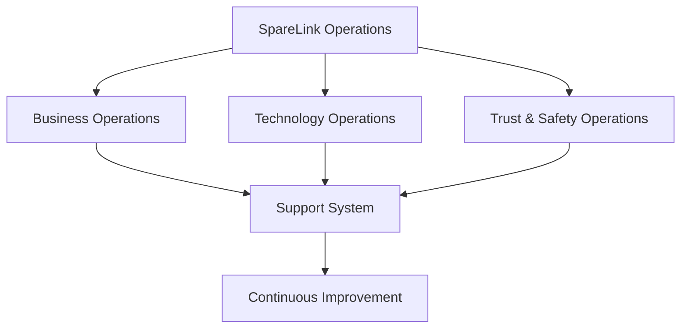
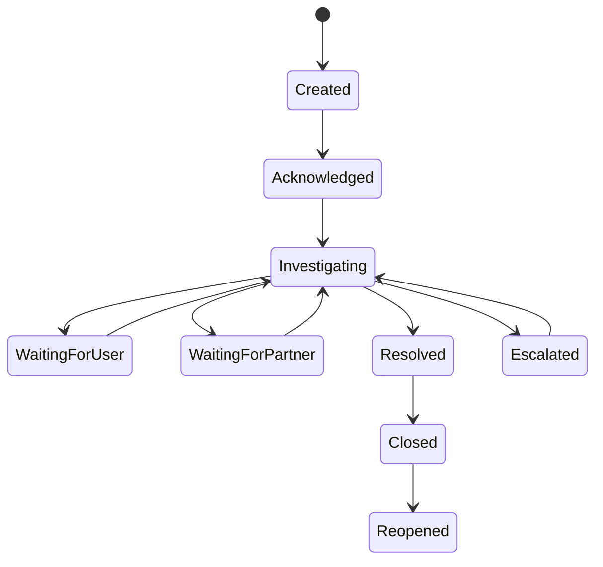
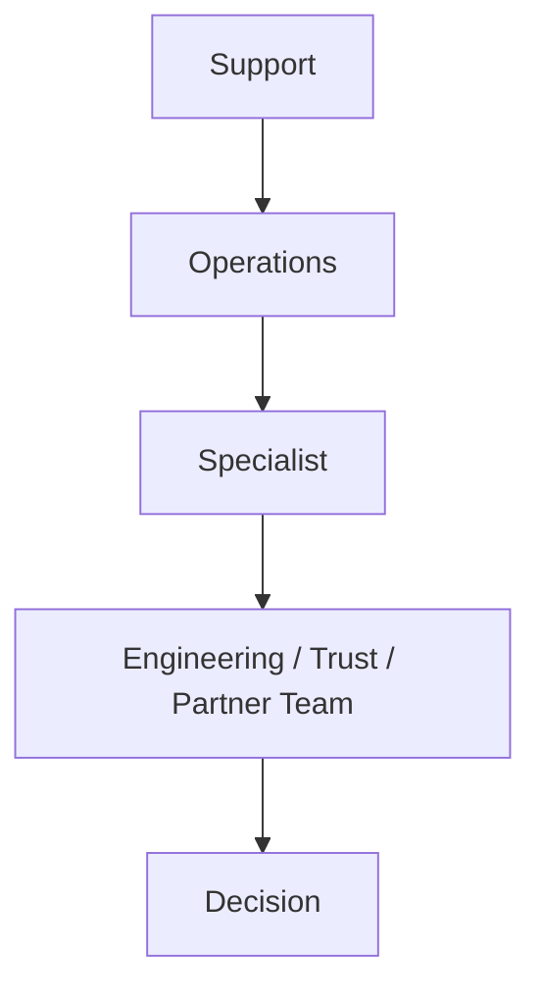
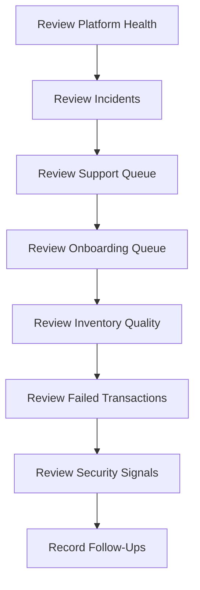
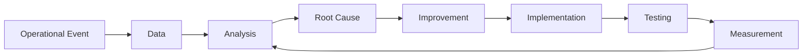
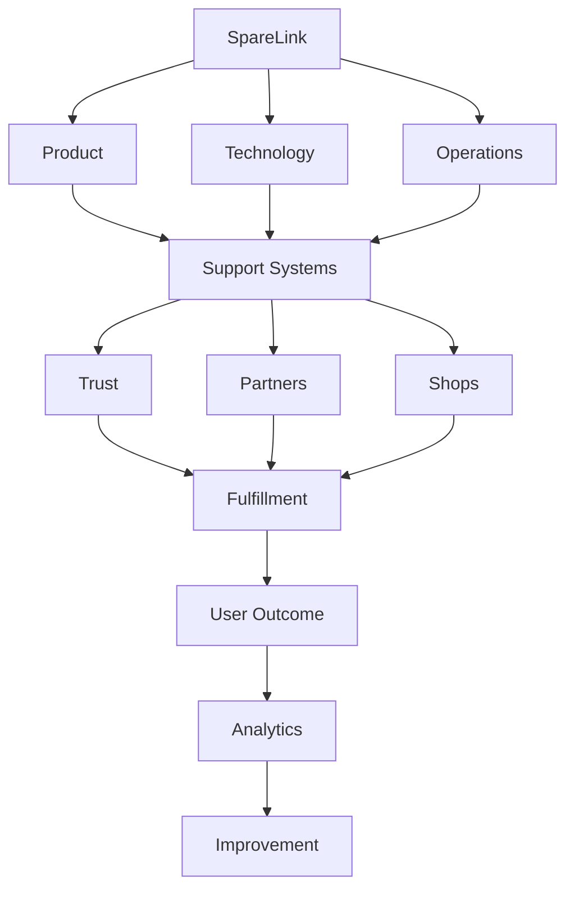

# SpareLink | Business Operations, Customer Support, Partner Operations & Platform Governance

**Part 16 of the SpareLink MVP documentation**

> **Technology powers SpareLink, but disciplined operations make SpareLink dependable.**

Part 16 continues directly from Parts 1–15 and defines the complete operating model required to run SpareLink as a real platform serving a growing network of repair businesses.

This part moves beyond how the system is built and focuses on:

```text
How the system is operated
+
How people interact with the system operationally
+
How problems are handled
+
How businesses are supported
+
How partners are managed
+
How platform governance works
```

The operating model must preserve the security, privacy, trust, testing, analytics, scalability, and platform-evolution principles established in Parts 1–15.

---

## 1. Part 16 Objective

Part 16 defines the operating framework for:

- business operations
- shop onboarding and verification
- customer and partner support
- supplier, inventory, request, and fulfillment operations
- disputes and incident management
- service management and escalation
- trust, safety, abuse, and fraud operations
- human review and AI escalation
- data and quality operations
- communication protocols
- operational dashboards
- runbooks and standard operating procedures
- business continuity and emergency procedures
- partner management
- account and shop lifecycle management
- operational metrics
- role definitions and responsibilities
- internal tooling
- auditability
- change and release management
- post-incident review
- continuous improvement
- MVP/P1/P2/P3 priorities

The operating principle is:

> **Every important process should have clear ownership, a defined trigger, a controlled decision path, and an auditable outcome.**

---

## 2. Operating Philosophy

SpareLink should operate according to:

```text
Clear Ownership
+
Defined Processes
+
Fast Detection
+
Controlled Escalation
+
Human Judgment Where Required
+
Documented Decisions
+
Measured Outcomes
+
Continuous Improvement
```

Avoid unnecessary bureaucracy.

For each operational process define:

```text
Trigger
↓
Owner
↓
Action
↓
Decision
↓
Outcome
↓
Record
```

A process is operationally useful only when the people responsible for it know what happens next.

---

## 3. Operating Model

The major operating domains are:



### Business Operations

Owns shop onboarding, inventory operations, request workflows, fulfillment coordination, and business-facing processes.

### Technology Operations

Owns service health, releases, technical incidents, reliability, and engineering support.

### Trust & Safety Operations

Owns abuse, suspicious activity, account restrictions, sensitive reviews, and safety-related processes.

### Support System

Connects users and businesses to the operational teams and preserves case history.

### Continuous Improvement

Uses operational evidence, analytics, incidents, and quality findings to improve the system.

---

## 4. Organizational Roles

Practical roles may include:

```text
Platform Admin
Operations Manager
Customer Support
Shop Onboarding Specialist
Trust & Safety Operator
Technical Operator
Partner Manager
Developer
Data / Analytics Operator
```

For each role define:

| Area | Required Definition |
|---|---|
| Responsibilities | What the role owns |
| Permissions | What actions it may perform |
| Tools | What operational systems it uses |
| Escalation authority | Which decisions it may escalate |
| Data access | Which information it can see |
| Prohibited actions | Which actions it must not perform |

The MVP staffing model should remain small.

---

## 5. Role-Based Operational Access

Connect operations directly to Part 12 security.

```text
Role
↓
Allowed Actions
↓
Data Access
↓
Audit Trail
```

Examples:

```text
Support
→ View support-relevant information

Operations
→ Manage operational workflows

Admin
→ Platform-level controls

Developer
→ Technical systems

Trust Operator
→ Abuse / safety workflows
```

Operational staff must not automatically receive unrestricted access to all business data.

---

## 6. Shop Onboarding Operations

The complete onboarding process is:


Operational procedures should define:

- required information
- validation
- verification
- common errors
- onboarding assistance
- activation criteria
- rejection state
- pending state

A shop should not be considered fully operational merely because registration succeeded.

---

## 7. Shop Verification

Possible verification progression:

```text
Registered
↓
Contact Verified
↓
Shop Information Verified
↓
Operationally Active
```

Keep these concepts distinct:

```text
Identity Verification
vs
Business Verification
vs
Operational Activity
```

Verification signals must not be presented as guarantees of trustworthiness.

---

## 8. Shop Activation

Potential activation requirements:

- verified contact
- valid shop profile
- valid location
- minimum required information
- onboarding completion
- inventory setup where required

Possible lifecycle states:

```text
PENDING
ACTIVE
SUSPENDED
INACTIVE
DEACTIVATED
```

Every transition should be authorized, documented, and auditable.

---

## 9. Shop Lifecycle

The complete lifecycle is:

```text
Prospect
↓
Registered
↓
Onboarding
↓
Verified
↓
Active
↓
Temporarily Inactive
↓
Suspended / Under Review
↓
Reactivated or Deactivated
```

State changes should preserve the audit trail and should not silently erase previous operational context.

---

## 10. Inventory Operations

Operational inventory processes include:

- inventory creation
- inventory updates
- stale inventory review
- out-of-stock handling
- duplicate cleanup
- incorrect inventory correction
- inventory disputes

Define who can:

```text
Create
Edit
Deactivate
Review
Restore
```

inventory records.

Inventory operations must preserve the integrity controls established in Parts 5, 8, 12, and 13.

---

## 11. Inventory Freshness Operations

Connect Parts 5, 8, 12, 13, and 14:

```text
Inventory Not Updated
↓
Freshness Threshold Exceeded
↓
Flag Record
↓
Shop Reminder
↓
Update / Confirm
↓
Record Result
```

Inventory should not be automatically removed or invalidated unless the relevant business rules explicitly permit that action.

---

## 12. Request Operations

Operational teams may need to handle requests in states such as:

```text
Normal
Needs Confirmation
No Match
Supplier Issue
Inventory Issue
Support Required
Disputed
Resolved
```

Human intervention may be required when a request cannot safely progress through automated flows.

---

## 13. Human-in-the-Loop Architecture

Humans intervene when automated systems cannot safely or confidently finish the workflow.

### AI uncertainty

```text
AI Uncertain
↓
User Confirmation
```

### Sensitive operational issue

```text
System Detects Exception
↓
Operations Review
```

### Dispute

```text
Dispute
↓
Support Review
↓
Evidence
↓
Resolution
```

### Suspicious activity

```text
Detection
↓
Trust Review
↓
Action
```

Human review must never bypass authorization controls.

---

## 14. Customer Support Model

Potential support channels:

```text
In-App Help
Email
WhatsApp where appropriate
Phone support where available
```

The support system should remain the source of truth for cases instead of scattering critical history across personal communications.

---

## 15. Support Ticket Lifecycle



Not every ticket will use every state, but the lifecycle should support controlled investigation, waiting, escalation, and reopening.

---

## 16. Support Ticket Data

Potential fields:

```text
ticket_id
request_id
shop_id
category
priority
status
assigned_to
created_at
updated_at
resolution
internal_notes
```

Avoid unnecessary sensitive information.

---

## 17. Support Categories

Use a structured support taxonomy:

```text
Account
Onboarding
Inventory
Matching
Reservation
Fulfillment
Payment
Notification
Technical Issue
Dispute
Abuse / Safety
Other
```

Structured categories support routing, reporting, and Part 14 analytics.

---

## 18. Support Priority

Priority is based on operational impact.

### Critical

Core service unavailable or serious security/business impact.

### High

Important transaction blocked.

### Medium

Major inconvenience with a workable path around the issue.

### Low

Minor issue or information request.

Ticket priority should not be based solely on who submitted the ticket.

---

## 19. Escalation Model



For each escalation define:

- trigger
- destination
- evidence
- owner
- expected next action

Avoid escalation loops where a case moves between teams without ownership.

---

## 20. Incident Management

Incident lifecycle:

```text
Detection
↓
Triage
↓
Classification
↓
Owner Assigned
↓
Containment
↓
Recovery
↓
Verification
↓
Communication
↓
Post-Incident Review
```

This connects directly to Part 13 testing, Part 15 reliability evolution, and the incident controls of this operating model.

---

## 21. Incident Severity

Possible levels:

```text
SEV-1
SEV-2
SEV-3
SEV-4
```

Severity should consider:

- user impact
- transaction impact
- security impact
- data integrity
- duration
- affected scope

Response commitments should not be invented without an actual operating policy.

---

## 22. Incident Command

For major incidents assign clear roles:

```text
Incident Lead
Technical Lead
Operations Lead
Communications Owner
Trust / Security Owner where applicable
```

Each role should have a specific responsibility.

The incident response team should avoid having every participant perform every task.

---

## 23. Incident Communication

Communication layers:

```text
Internal Team
↓
Affected Partners
↓
Affected Users
↓
Status Update
↓
Resolution
```

Communications should be:

- factual
- clear
- timely
- non-speculative
- privacy-safe

Do not expose internal debugging details unnecessarily.

---

## 24. Status Page

For appropriate service disruptions, statuses may include:

```text
Operational
Degraded
Partial Outage
Major Outage
Maintenance
Resolved
```

The status page should describe user impact instead of internal technical jargon.

---

## 25. Incident Runbooks

Common runbooks should provide a repeatable operating path.

### Database Failure

```text
Detect
↓
Verify
↓
Protect Data
↓
Failover / Recovery
↓
Verify
↓
Communicate
```

### AI Provider Failure

```text
Detect
↓
Enable Fallback
↓
Manual Request Option
↓
Monitor
↓
Restore
```

### Notification Failure

```text
Detect
↓
Retry
↓
Fallback Channel
↓
Verify
```

Each runbook should define ownership, prerequisites, logging, and recovery expectations.

---

## 26. Security Incident Operations

Connect directly with Part 12.

Scenarios include:

```text
Compromised Account
API Key Exposure
Unauthorized Access
Malicious Upload
Abusive Automation
Suspicious Inventory Manipulation
```

Response:

```text
Detect
↓
Contain
↓
Investigate
↓
Remediate
↓
Recover
↓
Review
```

Investigative information must remain restricted to authorized personnel.

---

## 27. Trust & Safety Operations

Handle:

- fake inventory
- impersonation
- abusive communication
- repeated fraudulent behavior
- suspicious accounts
- malicious uploads
- manipulation of system signals

Possible actions:

```text
Warning
Review
Temporary Restriction
Suspension
Permanent Deactivation
```

Actions should follow documented rules and available evidence.

---

## 28. Dispute Operations

Potential dispute reasons:

```text
Wrong Part
Wrong Quantity
Part Not Received
Damaged Part
Supplier Unavailable
Reservation Issue
Other
```

Workflow:

```text
Dispute Created
↓
Evidence Collected
↓
Parties Reviewed
↓
Operational Decision
↓
Resolution
↓
Audit Record
```

The process should avoid automatically assigning blame.

---

## 29. Dispute Evidence

Potential evidence:

- request history
- reservation state
- timestamps
- inventory records
- communication metadata
- fulfillment confirmation
- uploaded evidence where supported

Access to private information should be minimized.

---

## 30. Partner Operations

External partners may include:

```text
Messaging Provider
AI Provider
Payment Provider
Delivery Provider
Cloud Provider
Repair Software Integrations
```

Track:

- partner status
- integration status
- service health
- operational owner
- incidents
- fallback plan
- dependency risk

Each critical dependency should have a known operational path.

---

## 31. Partner Onboarding

Partner onboarding can follow:

```text
Partner Candidate
↓
Technical Review
↓
Security Review
↓
Integration
↓
Testing
↓
Pilot
↓
Production
```

No third-party integration should bypass security validation.

---

## 32. Partner Offboarding

Safe partner removal:

```text
Disable New Traffic
↓
Complete / Migrate Existing Work
↓
Revoke Credentials
↓
Remove Access
↓
Verify
↓
Archive Integration Data
```

Do not remove a critical provider while active transactions depend on it without a recovery plan.

---

## 33. SLA / SLO-Aware Operations

Operational teams should monitor relevant service indicators, such as:

- availability
- API latency
- notification delivery
- AI response latency
- reservation success
- incident recovery

Do not create contractual SLA commitments unless they have actually been adopted.

---

## 34. Operational Dashboard

Suggested sections:

```text
Current Incidents
Open Support Tickets
Pending Onboarding
Inventory Issues
Active Requests
Reservation Problems
Notification Health
AI Health
Partner Health
Security Signals
```

Operational prioritization should be based on actual impact.

---

## 35. Daily Operations

Example operating routine:



Avoid repetitive checks that can safely be automated.

---

## 36. Weekly Operations Review

Review:

- request volume
- match success
- fulfillment
- support
- incidents
- inventory quality
- AI quality
- notification reliability
- partner health
- security issues
- unresolved operational risks

Every meaningful issue should have:

```text
Owner
Status
Next Action
```

---

## 37. Monthly Operations Review

Review:

```text
Network Health
+
Product Health
+
Operational Health
+
Security
+
Partner Health
+
Cost
+
Major Trends
```

Connect this review to Part 14 analytics.

Dashboards should lead to decisions or follow-ups, not become passive reporting.

---

## 38. Shop Success Operations

Useful operational signals include:

```text
Inventory Updated Recently
Requests Completed
Pending Requests
No-Match Opportunities
Onboarding Completion
```

These signals should help shops use the platform more effectively.

They should not automatically become broad reputational judgments.

---

## 39. Shop Education

Provide practical onboarding material covering:

- how to add inventory
- how to request parts
- how matching works
- how reservations work
- how fulfillment works
- how to report problems
- how to keep inventory current

The material should remain simple and operationally useful.

---

## 40. Operational Playbooks

Every playbook should contain:

```text
Purpose
Trigger
Owner
Prerequisites
Steps
Decision Points
Escalation
Expected Outcome
Logging
Rollback / Recovery
```

Examples:

```text
New Shop Onboarding
Inventory Correction
Supplier Decline
Reservation Failure
Dispute Handling
Security Incident
AI Outage
Notification Outage
```

---

## 41. Standard Operating Procedures

For recurring workflows define:

```text
SOP ID
Name
Purpose
Owner
Inputs
Procedure
Expected Result
Exceptions
Escalation
Review Date
Version
```

Every important SOP should have an owner and a review point.

---

## 42. Change Management

Operational change control:

```text
Proposed Change
↓
Impact Review
↓
Testing
↓
Approval
↓
Deployment
↓
Verification
↓
Documentation
```

Emergency changes may use a simplified path, but they must remain auditable.

---

## 43. Release Operations

Connect Part 11 and Part 13.

Before release:

```text
Tests Pass
↓
Security Checks
↓
Migration Review
↓
Operational Readiness
↓
Release
↓
Smoke Test
↓
Monitoring
```

Production approval authority should be explicit.

---

## 44. Operational Readiness Checklist

Before launching a feature verify:

```text
Documentation
+
Support Training
+
Monitoring
+
Alerts
+
Runbook
+
Rollback Plan
+
Security
+
Analytics
+
User Communication
```

Code completion is not the same as operational readiness.

---

## 45. Support Knowledge Base

The knowledge base should contain:

- common problems
- troubleshooting
- onboarding guides
- FAQs
- known issues
- escalation rules
- support scripts
- policy references

Content should be appropriate for its intended audience.

---

## 46. Known Issues Management

Maintain:

```text
Issue
Impact
Workaround
Status
Owner
Expected Resolution
```

Known problems should remain visible to the internal teams responsible for operating the platform.

---

## 47. Customer Communication Framework

Prepare templates for:

- request delays
- supplier decline
- inventory unavailable
- service outage
- reservation failure
- fulfillment issue
- account restriction
- maintenance

Messages should distinguish:

```text
Confirmed Fact
vs
Estimated Information
```

Never invent certainty.

---

## 48. AI Escalation Operations

Move AI-assisted workflows to manual review when there is:

```text
Low Confidence
+
Critical Ambiguity
+
Repeated User Correction
+
Potentially Unsafe Interpretation
```

Workflow:

```text
AI Analysis
↓
Validation
↓
Uncertainty Detected
↓
User Confirmation or Human Review
↓
Resolution
```

AI is a support capability, not an operational authority.

---

## 49. Quality Operations

Operational quality checks should cover:

- inventory quality
- match quality
- support quality
- fulfillment quality
- data quality
- AI quality
- notification quality

Use the evidence standards established in Part 13 and the metrics defined in Part 14.

---

## 50. Service Recovery

When SpareLink cannot complete a workflow:

```text
Failure
↓
Detect
↓
Preserve State
↓
Notify User
↓
Offer Recovery
↓
Retry / Alternative
↓
Complete or Close
```

Do not blindly retry irreversible actions.

---

## 51. Business Continuity

Potential disruptions include:

```text
Cloud Outage
AI Outage
Messaging Outage
Payment Outage
Regional Network Failure
Staff Unavailability
Security Incident
Database Failure
```

For each define:

```text
Critical Capability
Fallback
Owner
Recovery Method
Communication
```

Business continuity is a controlled operating capability, not an assumption that failures will never occur.

---

## 52. Manual Fallback Operations

Controlled manual alternatives may include:

```text
AI unavailable
→ Manual request creation

Realtime unavailable
→ Polling / manual refresh

Notification provider unavailable
→ In-app communication

Automated partner integration unavailable
→ Support-assisted process where appropriate
```

Manual fallback must preserve authorization, state integrity, and auditability.

---

## 53. Operational Data Governance

Define who can:

```text
View
Create
Modify
Export
Delete
```

operational records.

Important operational records must remain auditable.

Access should follow the role model rather than personal convenience.

---

## 54. Business Rule Governance

When a business rule changes:

```text
Current Rule
↓
Proposed Rule
↓
Impact Analysis
↓
Testing
↓
Approval
↓
Implementation
↓
Monitoring
```

Critical matching and reservation rules should not be altered directly in production without controlled review.

---

## 55. Metric Ownership

Every important metric should have an owner.

| Metric | Owner |
|---|---|
| Match Rate | Matching / Product |
| Inventory Freshness | Operations |
| Support Resolution | Support |
| API Availability | Engineering |
| AI Validation Failure | AI / Engineering |
| Fulfillment Completion | Operations |

Use the canonical metric definitions established in Part 14.

---

## 56. Operational Risk Register

Maintain a risk register:

```text
Risk
Probability
Impact
Current Controls
Owner
Mitigation
Status
```

Do not assign arbitrary numeric risk scores without a defined methodology.

The purpose is visibility, ownership, and mitigation.

---

## 57. Vendor / Dependency Risk

Track key dependencies:

```text
AI Provider
Messaging Provider
Cloud
Storage
Payment
Delivery
Maps / Geolocation
```

For each evaluate:

- criticality
- fallback
- outage impact
- security dependency
- operational owner

This connects with the provider abstraction and dependency architecture defined in Part 15.

---

## 58. Audit and Compliance Operations

Maintain appropriate records for:

- account changes
- role changes
- suspensions
- inventory corrections
- reservations
- disputes
- security incidents
- administrative actions
- data exports

Do not collect records beyond legitimate operational requirements.

---

## 59. Operational Security Training

Staff with platform access should understand:

- account security
- phishing awareness
- customer-information handling
- privacy
- access control
- incident reporting
- secure support practices
- secrets handling

Training should reflect the current controls rather than generic checklists alone.

---

## 60. Continuous Improvement Loop

Connect Parts 13, 14, 15, and 16:



Do not repeatedly patch symptoms without examining recurring causes.

---

## 61. Root Cause Analysis

For major incidents or recurring failures ask:

```text
What happened?
Why did it happen?
Why was it not detected earlier?
What control failed?
What prevents recurrence?
```

Focus on system improvement and clear accountability rather than blame.

---

## 62. Post-Incident Review

After a significant incident record:

```text
Timeline
Impact
Detection
Response
Recovery
Root Cause
Contributing Factors
What Worked
What Failed
Corrective Actions
Owners
Deadlines
```

Do not expose sensitive security details unnecessarily.

---

## 63. Operational Maturity Model

SpareLink can mature through:

```text
Level 1
Reactive
↓
Level 2
Documented
↓
Level 3
Measured
↓
Level 4
Automated
↓
Level 5
Predictive
```

Progress should be gradual.

Advanced automation should not be built before basic operational processes are reliable.

---

## 64. MVP Operating Model

### P0: Required

```text
Basic Shop Onboarding
+
Support Process
+
Incident Process
+
Dispute Process
+
Core Runbooks
+
Role-Based Operations
+
Basic Monitoring
+
Security Escalation
+
Operational Dashboard
```

### P1

```text
Advanced Support Tools
+
Partner Operations
+
Advanced Incident Automation
+
Trust Operations
+
Operational Analytics
+
Knowledge Base
```

### P2

```text
Predictive Operations
+
Advanced Automation
+
Global Partner Operations
+
Automated Incident Correlation
+
Advanced Workforce Planning
```

### P3: Future

```text
Autonomous Operational Optimization
+
Advanced AI Operations
+
Large-Scale Global Operations
```

Do not implement P2 or P3 capabilities merely to appear enterprise-ready.

---

## 65. Complete Operating Model



These functions are interconnected:

- Product defines user workflows.
- Technology keeps the platform operational.
- Operations coordinates business processes.
- Support handles user and shop issues.
- Trust protects the platform.
- Partners extend the platform.
- Fulfillment produces the practical transaction outcome.
- Analytics measures what happened.
- Continuous improvement feeds evidence back into the system.

---

## 66. End-to-End Operational Example

Example request:

> **Repair shop:** “I need a Samsung M14 display.”

Operational flow:

```text
Repair Shop Requests Part
↓
AI Interprets Request
↓
Matching Engine Finds Possible Suppliers
↓
Supplier Accepts
↓
Inventory Re-Check Succeeds
↓
Reservation Created
↓
Supplier Becomes Unavailable Unexpectedly
↓
Operational Exception Detected
↓
Support / Operations Receives Signal
↓
Alternative Supplier Search Begins
↓
User Receives Updated Status
↓
Alternative Supplier Selected
↓
Fulfillment Completes
↓
Exception Recorded
↓
Analytics Evaluates Why Fallback Was Required
↓
Product Team Investigates Recurring Pattern
```

This demonstrates how product, technology, operations, support, trust, fulfillment, and analytics cooperate around one real workflow.

---

## 67. Definition of Done

Part 16 is complete when the operating model defines:

- operating model
- organizational roles
- role-based operational access
- shop onboarding operations
- verification operations
- shop activation and lifecycle
- inventory operations
- inventory freshness operations
- request operations
- human-in-the-loop architecture
- customer support
- support ticket lifecycle
- support categories
- support priority
- escalation
- incident management
- incident severity
- incident command
- incident communication
- status communication
- incident runbooks
- security incident operations
- trust and safety operations
- dispute operations
- dispute evidence
- partner operations
- partner onboarding
- partner offboarding
- service-level operational concepts
- operational dashboard
- daily operations
- weekly review
- monthly review
- shop success operations
- shop education
- operational playbooks
- SOPs
- change management
- release operations
- operational readiness
- support knowledge base
- known-issues process
- customer communication framework
- AI escalation
- quality operations
- service recovery
- business continuity
- manual fallbacks
- operational data governance
- business rule governance
- metric ownership
- operational risk management
- dependency risk
- audit operations
- operational security training
- continuous improvement
- root cause analysis
- post-incident review
- operational maturity
- MVP/P1/P2/P3 priorities

As with previous parts, **defined does not mean implemented**.

---

## Connection to Part 17

Part 17 should continue from the operating model and define:

- commercialization
- go-to-market strategy
- adoption
- pricing architecture
- business-model experimentation
- growth systems
- market expansion
- customer acquisition
- shop network development
- partnerships
- sales operations
- sustainable platform economics

Parts 1–16 now define:

```text
What SpareLink Is
↓
The User Problem
↓
Product Experience
↓
Technical Architecture
↓
AI
↓
Matching
↓
Fulfillment
↓
Security
↓
Testing
↓
Analytics
↓
Scalability
↓
Platform Evolution
↓
Operations
↓
Support
↓
Governance
```

Part 17 should answer:

> **How does SpareLink become a sustainable product that can attract, serve, retain, and grow a network of participating businesses?**

Possible areas include:

```text
Business Model
+
Pricing
+
Go-To-Market
+
Customer Acquisition
+
Shop Acquisition
+
Network Growth
+
Sales Operations
+
Partnership Strategy
+
Market Expansion
+
Unit Economics
+
Commercial Experiments
```

Do not assume a specific pricing model is automatically correct. Business models should be evaluated using explicit assumptions and measured evidence.

---

# Final Principle

SpareLink is not complete when:

```text
The Software Works
```

It becomes operationally mature when:

```text
Users Can Get Help
+
Businesses Can Operate
+
Problems Can Be Escalated
+
Incidents Can Be Recovered
+
Partners Can Be Managed
+
Security Can Be Enforced
+
Decisions Can Be Audited
+
Processes Can Improve
```

The operating loop is:

```text
Operate
↓
Observe
↓
Detect
↓
Respond
↓
Recover
↓
Learn
↓
Improve
```

The final operational philosophy is:

> **Reliable platforms are built not only from code, but from clear ownership, disciplined processes, measured outcomes, and strong recovery systems.**

The architecture may be complex.

The AI may be advanced.

The network may become large.

But every important operational question should have a clear answer:

```text
Who owns this?
What happened?
What should happen next?
Who decides?
How is it recorded?
How do we prevent it from happening again?
```

The product should remain simple even when the operating system behind it becomes sophisticated.

```text
Complex Operations Inside
+
Simple User Experience Outside
=
SpareLink
```

---

## Current / Planned / Manual / Automated / Future

This classification should remain explicit:

| Status | Meaning |
|---|---|
| **Current** | Intended as part of the current operating model / MVP |
| **Planned** | Identified future operational work |
| **Manual** | Requires human action |
| **Automated** | Performed by configured system processes |
| **Future** | Long-term capability requiring additional evidence or scale |

Do not claim operational capabilities that have not actually been implemented.

---

## Documentation Status

**Part:** 16  
**Title:** Business Operations, Customer Support, Partner Operations & Platform Governance  
**Repository:** `bharath20865/sparelink`  
**Document Path:** `docs/16-business-operations-customer-support-partner-operations-platform-governance.md`  
**Implementation Status:** Operating model defined; operational execution is not claimed  
**Next Part:** Part 17 — Commercialization, Go-To-Market, Growth & Sustainable Platform Economics
