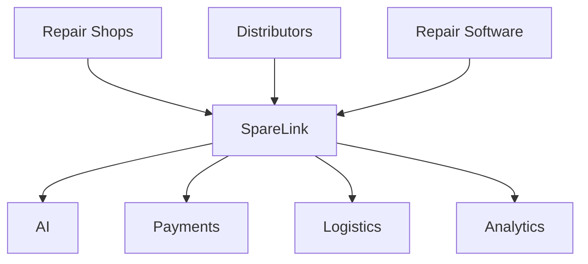
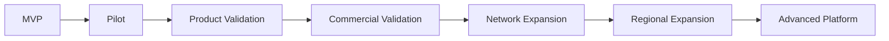
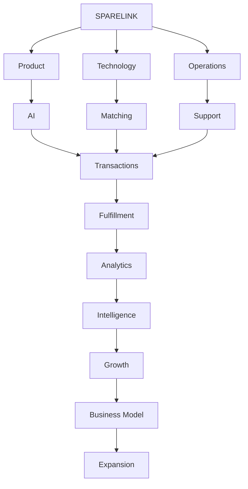
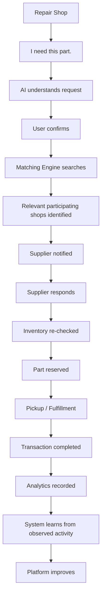

# SpareLink | Business Model, Go-To-Market, Growth & Final Platform Vision

**Part 17 of 17 of the SpareLink documentation**

> **Build a useful network first, prove real value, measure the economics, and scale only when the evidence supports it.**

Part 17 is the **final main documentation chapter** of SpareLink. It connects the technical, product, intelligence, operational, and governance foundations established in Parts 1–16 to the question:

> **How can SpareLink become a sustainable, widely adopted platform while preserving the simplicity of its original idea?**

The intended commercial sequence is:

```text
Problem
↓
Value
↓
Adoption
↓
Usage
↓
Retention
↓
Network Density
↓
Sustainable Economics
↓
Growth
```

Commercial growth is evidence-led. Pricing, acquisition, monetization, and expansion are hypotheses until validated by real usage and measured results.

---

## 1. Part 17 Objective

Part 17 defines the commercial and strategic layer covering:

- business model
- value proposition
- customer and shop segments
- customer personas
- pricing architecture
- monetization options
- go-to-market
- customer acquisition
- shop acquisition
- network growth
- geographic expansion
- sales strategy and sales operations
- partnerships and channel strategy
- activation, retention, and churn
- customer success
- unit economics
- cost structure
- AI economics
- business experiments
- market validation
- competitive positioning
- ecosystem strategy
- commercial risks
- strategic assumptions
- growth stages
- commercialization roadmap
- long-term platform vision
- final project definition

No monetization model is assumed to be automatically correct.

---

## 2. Business Philosophy

SpareLink should follow:

```text
Problem
↓
Value
↓
Adoption
↓
Usage
↓
Retention
↓
Network Density
↓
Sustainable Economics
↓
Growth
```

Avoid:

```text
Pricing
↓
Aggressive Growth
↓
Hope
```

Every important commercial assumption should be testable.

A business model is not validated because it sounds attractive in a presentation. It is validated when users, shops, and the network demonstrate behavior that supports the underlying assumptions.

---

## 3. Core Value Proposition

The original problem remains simple:

> Repair shops may struggle to find required spare parts even when suitable inventory exists at another participating nearby repair business.

SpareLink connects:

```text
Repair Shop
+
Required Part
+
Nearby Inventory
+
Matching
+
Coordination
```

The core promise is:

> **Find relevant spare-part availability across nearby participating repair businesses.**

The platform should not claim:

- guaranteed availability
- guaranteed savings
- guaranteed delivery time
- guaranteed successful fulfillment

unless such claims are explicitly supported by measured evidence and an applicable service commitment.

---

## 4. Customer Segments

### Primary

```text
Mobile Repair Shops
Electronics Repair Shops
Independent Technicians
```

### Secondary

```text
Appliance Repair
Computer Repair
Other Local Repair Businesses
```

### Future

```text
Larger Repair Networks
Distributors
Enterprise Repair Organizations
```

Different segments may have different:

- workflows
- transaction frequency
- inventory sizes
- support needs
- pricing tolerance
- integration needs

Do not assume that all repair businesses behave identically.

---

## 5. Customer Personas

These personas are hypothetical representations.

### Small Shop Owner

Needs:

```text
Fast Search
Low Friction
Simple UI
Low Cost
```

### Busy Technician

Needs:

```text
Quick Request
Voice / Text
Minimal Interaction
```

### Inventory-Rich Shop

Needs:

```text
Inventory Visibility
Incoming Requests
Easy Fulfillment
```

### Network / Enterprise Partner

Needs:

```text
APIs
Reporting
Access Controls
Operational Reliability
```

Personas should be refined using interviews, observation, pilot behavior, and analytics.

---

## 6. Value Exchange

Each participant contributes to and receives value from the network.

```text
Requesting Shop
→ Creates Demand

Supplying Shop
→ Provides Available Inventory

SpareLink
→ Coordinates the Network
```

### Requesting Shop

Potential value:

- easier discovery
- less manual calling and messaging
- visibility into participating nearby inventory

### Supplying Shop

Potential value:

- additional opportunities to fulfill demand
- better utilization of relevant inventory

### SpareLink

Potential value:

- platform usage
- transaction activity
- network activity
- future analytical and integration value

These are value hypotheses, not guarantees of financial benefit.

---

## 7. Business Model Options

SpareLink can evaluate multiple models.

### Subscription

```text
Monthly / Annual Plan
```

Possible advantages:

- predictable recurring revenue
- simple forecasting

Possible limitations:

- shops may resist paying before value is demonstrated
- subscription gating may reduce network participation

### Transaction Fee

```text
Fee Per Completed Transaction
```

Possible advantages:

- aligns payment with realized activity

Possible limitations:

- requires trustworthy transaction measurement
- may influence behavior around small-value transactions

### Freemium

```text
Free Basic Usage
+
Paid Advanced Features
```

Possible advantages:

- lowers initial adoption friction

Possible limitations:

- requires careful definition of free vs paid capabilities

### Premium Analytics

```text
Advanced Insights
+
Inventory Intelligence
+
Reports
```

### Enterprise

```text
Custom Plans
+
API Access
+
Dedicated Support
```

### Integration Fees

Applicable where specialized partner integration creates meaningful implementation value.

For each model evaluate:

```text
Value
+
Advantages
+
Limitations
+
Operational Complexity
+
Measurement Needed
```

The documentation does not declare a universal winner.

---

## 8. Pricing Principles

Do not invent final prices before validation.

Pricing should aim to be:

```text
Simple
+
Understandable
+
Aligned With Value
+
Affordable for Target Users
+
Sustainable
```

Possible pricing variables include:

- usage
- number of users
- inventory size
- transaction volume
- analytics features
- API usage
- support requirements

Pricing must be experimentally validated.

---

## 9. Freemium Strategy

If freemium is tested:

```text
Free
↓
Habit Formation
↓
Network Participation
↓
Advanced Need
↓
Premium
```

The free layer should retain enough core functionality for the network to remain useful.

Define explicitly:

```text
Free
vs
Paid
```

Do not create a free tier that makes the fundamental network value inaccessible.

---

## 10. Go-To-Market Strategy

Use a staged launch:

```text
Pilot Area
↓
Local Cluster
↓
City
↓
Multiple Cities
↓
Regional Network
```

Every stage should validate:

- shop participation
- inventory density
- request volume
- match quality
- fulfillment
- operational workload
- retention

Expansion should depend on evidence rather than calendar dates alone.

---

## 11. Beachhead Market

A potential initial market can be evaluated using:

```text
High Shop Density
+
Strong Repair Activity
+
Relevant Spare-Part Diversity
+
Manageable Geography
+
Accessible Partner Network
```

No particular city should be labeled the ideal market without validation.

---

## 12. Supply-Side First Strategy

A marketplace needs useful supply.

```text
Recruit Shops
↓
Populate Inventory
↓
Establish Network Coverage
↓
Acquire Demand
↓
Generate Matches
```

An empty or inaccurate inventory network can make a technically functional product appear broken.

Supply quality therefore matters before demand scaling.

---

## 13. Demand-Side Strategy

After useful supply exists:

```text
Acquire Users
↓
Create Requests
↓
Generate Transactions
↓
Demonstrate Value
↓
Encourage Repeat Usage
```

Part 14 analytics should measure the complete funnel.

---

## 14. Network Liquidity

Network liquidity is the practical combination of:

```text
Relevant Shops
+
Relevant Inventory
+
Active Demand
```

within a useful geographic area.

Measure:

```text
Requests
+
Eligible Inventory
+
Successful Matches
+
Fulfillment
```

A large registration count does not automatically mean the network is useful.

---

## 15. Shop Acquisition

Potential channels:

- direct outreach
- local repair associations
- referral programs
- partnerships
- college and hackathon demonstrations
- local business communities
- digital campaigns
- field onboarding

Measure the complete path:

```text
Lead
↓
Registration
↓
Activation
↓
Inventory Added
↓
First Request / Fulfillment
↓
Repeat Usage
```

Acquisition should be evaluated using meaningful downstream activity rather than raw leads alone.

---

## 16. Customer Acquisition

Potential channels:

- direct outreach
- partner referrals
- product-led onboarding
- WhatsApp sharing
- local community networks
- industry events
- targeted digital marketing

Track:

- acquisition source
- activation
- first meaningful usage
- repeat usage
- cost where measurable

Impressions alone are not evidence of product-market value.

---

## 17. Referral System

A future referral flow:

```text
Existing Shop
↓
Invites Another Shop
↓
New Shop Joins
↓
Verification
↓
Activation
```

Potential benefits:

- network expansion
- lower acquisition effort
- local cluster development

Any reward mechanism must be covered by anti-abuse controls from Part 12 and operational controls from Part 16.

---

## 18. Partner Strategy

Potential partners:

```text
Repair Associations
Distributors
Spare-Part Suppliers
Repair Software Providers
Logistics Providers
Payment Providers
Technology Providers
```

For each partnership evaluate:

```text
Why Partner
+
Integration
+
Value Exchange
+
Operational Dependency
```

A technically useful partnership may still be commercially unsuitable if it creates excessive dependency or operational burden.

---

## 19. Distribution Strategy

Possible channels:

```text
Direct Sales
+
Partnerships
+
Referrals
+
Community
+
Product-Led Growth
+
Integrations
```

Do not assume all channels will perform equally.

Use measured experiments.

---

## 20. Activation

Define an activated shop clearly.

Example:

```text
Registered
+
Verified
+
Profile Complete
+
Inventory Added
+
Ready to Participate
```

Registration alone should not be counted as meaningful activation.

---

## 21. Retention

Meaningful retention is:

```text
Shop Uses SpareLink
↓
Receives Value
↓
Returns
↓
Creates / Fulfills More Requests
```

Measure:

- repeat request activity
- repeat fulfillment
- active inventory
- returning shops

Connect commercial retention to Part 14 product analytics.

---

## 22. Churn

Potential churn signals:

```text
No Recent Activity
+
Inventory Stale
+
Repeated Failed Matches
+
Support Problems
```

These are signals for investigation, not proof of why a shop stopped using the platform.

Use evidence such as interviews, support history, and behavioral analytics before drawing conclusions.

---

## 23. Customer Success

Customer success extends beyond technical troubleshooting.

It may include:

- onboarding assistance
- inventory setup
- workflow education
- adoption guidance
- issue resolution
- usage feedback

The objective is successful product use rather than merely closing support tickets.

---

## 24. Sales Process

A scalable sales funnel can be:

```text
Lead
↓
Contact
↓
Demo
↓
Pilot
↓
Onboarding
↓
Activation
↓
Conversion
↓
Expansion
```

Each stage should have a clear definition and evidence.

---

## 25. Sales Operations

Track:

- leads
- qualified prospects
- demos
- pilots
- conversions
- sales cycle
- acquisition cost
- retention

Sales data should remain appropriately separated from sensitive operational and business data.

---

## 26. Unit Economics

### Customer Acquisition Cost

```text
CAC
=
Acquisition Cost
/
New Customers Acquired
```

### Customer Lifetime Value

Customer Lifetime Value estimates the expected economic value of a retained customer over an appropriate observation horizon.

Its definition must state assumptions about:

- revenue
- gross margin
- retention
- churn
- observation period

### Gross Margin

Gross margin describes the portion of revenue remaining after directly attributable costs.

### Contribution Margin

Contribution margin describes the value remaining after relevant variable costs associated with the product or transaction.

No actual SpareLink economics should be invented before measurement.

---

## 27. Cost Structure

Potential cost categories:

```text
Cloud Infrastructure
+
Database
+
AI Usage
+
Storage
+
Messaging
+
Maps / Geolocation
+
Payment Costs
+
Support
+
Sales
+
Operations
```

Technical architecture and business economics must be considered together.

---

## 28. AI Economics

Analyze:

```text
AI Request Volume
+
Average Cost Per Request
+
User Value
```

Potential routing:

```text
Simple Request
→ Lower-Cost Processing

Complex Request
→ Advanced Model
```

Do not sacrifice critical correctness for small cost reductions.

Part 15 provider abstraction and model-routing concepts support this strategy.

---

## 29. Network Economics

Network growth can be modeled as a hypothesis:

```text
More Shops
↓
More Inventory
↓
More Match Opportunities
↓
More Useful Transactions
↓
More Shop Value
↓
More Shops
```

This is not a guaranteed outcome.

Part 14 analytics should be used to measure whether the loop is actually occurring.

---

## 30. Commercial Experimentation

Every major commercial assumption should be tested:

```text
Hypothesis
↓
Experiment
↓
Metric
↓
Observation
↓
Decision
```

Potential experiments:

- pricing
- onboarding
- referral incentives
- subscription plans
- transaction fees
- acquisition channels

Avoid changing multiple major variables simultaneously when a clean experiment is possible.

---

## 31. Pricing Experiments

Potential alternatives:

```text
Free
vs
Freemium
vs
Subscription
vs
Transaction-Based
```

Measure:

- activation
- usage
- conversion
- retention
- support burden
- transaction volume

Short-term conversion alone is not sufficient evidence for a durable business model.

---

## 32. Market Validation

Validate:

```text
Problem Exists
+
Users Care
+
Users Use Solution
+
Network Can Function
+
Operations Are Manageable
+
Economics Can Work
```

Each claim requires corresponding evidence.

A successful prototype does not automatically validate a scalable business.

---

## 33. Competitive Positioning

Potential differentiators to investigate:

```text
Local Network
+
AI-Assisted Requests
+
Inventory-Aware Matching
+
Shop-to-Shop Coordination
+
Simple Workflow
```

Do not claim superiority over competitors without evidence.

Do not invent competitor statistics.

---

## 34. Competitive Analysis Framework

| Dimension | Traditional Method | SpareLink |
|---|---|---|
| Search | Manual | Network-assisted |
| Input | Calls / Messages | Structured request |
| Inventory visibility | Limited | Participating inventory |
| Matching | Human | Matching Engine |
| Coordination | Manual | Platform workflow |
| History | Fragmented | Recorded |

This table describes the intended product model. It does not claim measured performance superiority.

---

## 35. Brand Positioning

A simple identity:

> **SpareLink connects repair shops with nearby participating spare-part inventory.**

Brand principles:

```text
Simple
Useful
Local
Trustworthy
Fast to Understand
Operationally Reliable
```

Avoid exaggerated marketing claims.

---

## 36. Growth Loop

The intended growth loop is:

```text
Shop Joins
↓
Inventory Added
↓
Request Appears
↓
Match Happens
↓
Transaction Completes
↓
Value Demonstrated
↓
Shop Continues
↓
Another Shop Joins
```

Connect this loop with the network analytics from Part 14 and operating systems from Part 16.

---

## 37. Geographic Growth

Use a cluster strategy:

```text
Dense Local Cluster
↓
Adjacent Cluster
↓
City Coverage
↓
Regional Coverage
```

Avoid expanding geography faster than network density can support useful matching.

---

## 38. Regional Operating Model

As the network grows:

```text
Central Platform
+
Regional Operations
+
Local Support
+
Partner Management
```

Responsibilities must remain clear.

Regional expansion should not create uncontrolled operational variation.

---

## 39. Enterprise Strategy

Future enterprise customers may need:

- centralized inventory
- multi-location management
- advanced analytics
- APIs
- access controls
- auditability
- integrations
- support agreements

Enterprise capabilities must not distort the core small-shop experience.

---

## 40. API / Platform Monetization

Potential future monetization:

```text
API Access
+
Premium Integrations
+
Advanced Analytics
+
Enterprise Services
```

Technical availability does not prove commercial demand.

Validate willingness to pay separately.

---

## 41. Ecosystem Strategy

The mature ecosystem may connect:



SpareLink should remain a coordination layer rather than becoming unnecessarily dependent on a single partner.

---

## 42. Commercial Risks

Potential risks:

```text
Low Network Density
+
Low Inventory Accuracy
+
Low User Adoption
+
High Acquisition Cost
+
Low Retention
+
AI Cost
+
Operational Complexity
+
Partner Dependency
+
Trust Issues
```

For each risk define:

```text
Risk
↓
Signal
↓
Mitigation
```

Risk treatment should remain connected to Parts 12–16.

---

## 43. Strategic Assumptions Register

Track assumptions explicitly.

| Assumption | Evidence Needed | Status |
|---|---|---|
| Shops have recurring spare-part search problems | User interviews | TBD |
| Shops will share inventory | Pilot usage | TBD |
| Network matching provides value | Match / fulfillment data | TBD |
| Shops will return | Retention data | TBD |
| AI reduces input friction | User testing | TBD |

Assumptions are not established facts until supported by evidence.

---

## 44. Business Dashboard

Potential executive metrics:

```text
Active Shops
+
Active Inventory
+
Requests
+
Match Rate
+
Fulfillment Rate
+
Retention
+
CAC
+
Revenue
+
Support Load
+
Infrastructure Cost
```

These metrics should be sourced from the canonical analytics and operations systems defined in Parts 14 and 16.

---

## 45. Growth Stages

### Stage 1: Problem Validation

```text
Interviews
+
Prototype
+
Manual Pilot
```

### Stage 2: MVP Validation

```text
Working Product
+
Initial Shops
+
Real Usage
```

### Stage 3: Network Validation

```text
Multiple Shops
+
Repeat Requests
+
Reliable Matching
```

### Stage 4: Commercial Validation

```text
Pricing Experiments
+
Retention
+
Unit Economics
```

### Stage 5: Scale

```text
Regional Growth
+
Partners
+
Advanced Infrastructure
```

Do not skip stages merely to accelerate headline growth.

---

## 46. Commercialization Roadmap



For every stage define:

```text
Objective
Features
Evidence Required
Exit Criteria
```

A stage should progress only when its evidence supports the next level of complexity.

---

## 47. Success Criteria

Do not define success simply as:

```text
Many Users
```

Evaluate:

```text
Real Problem Solved
+
Repeat Usage
+
Useful Network
+
Reliable Fulfillment
+
Healthy Operations
+
Sustainable Economics
```

These dimensions should be considered together.

---

## 48. Failure Conditions

Conditions that may require strategic reconsideration:

```text
Persistent Low Match Rate
+
Low Repeat Usage
+
Poor Inventory Quality
+
Unsustainable Acquisition Cost
+
Excessive Operational Burden
```

Possible responses include:

```text
Improve
+
Pivot
+
Narrow Scope
+
Change Segment
```

Adding features is not the only response to weak evidence.

---

## 49. Final SpareLink Business Loop

```text
Problem
↓
Product
↓
Shops
↓
Inventory
↓
Requests
↓
Matches
↓
Fulfillment
↓
Value
↓
Retention
↓
Network Growth
↓
Sustainable Economics
↓
Expansion
```

This is the commercial version of the product's core coordination loop.

---

## 50. Complete SpareLink System

All major functions connect:



Every previous part contributes:

| Foundation | Contribution |
|---|---|
| Product | Defines the user problem and experience |
| Technology | Provides the application and platform foundation |
| AI | Assists with request understanding and future intelligence |
| Matching | Finds relevant participating inventory |
| Transactions | Coordinates reservation and business state |
| Fulfillment | Produces the practical outcome |
| Security | Protects users, shops, and data |
| Testing | Demonstrates quality |
| Analytics | Measures activity and outcomes |
| Scalability | Supports justified growth |
| Operations | Runs the platform |
| Governance | Controls risk and trust |
| Business | Creates a path to sustainability |

---

## 51. Complete 17-Part Roadmap

| Part | Focus | Purpose |
|---:|---|---|
| 1 | Idea Foundation | Define problem and solution |
| 2 | User Journey | Define user workflow |
| 3 | UI/UX | Define interaction design |
| 4 | Technical Architecture | Define system architecture |
| 5 | Database | Define data model |
| 6 | Backend | Define application logic |
| 7 | AI Engine | Define AI assistance |
| 8 | Matching Engine | Define intelligent matching |
| 9 | Frontend Integration | Connect product experience |
| 10 | Realtime & Fulfillment | Coordinate transactions |
| 11 | DevOps & Deployment | Operate infrastructure |
| 12 | Security & Trust | Protect users and businesses |
| 13 | Testing & Validation | Prove system quality |
| 14 | Analytics | Measure and learn |
| 15 | Scalability & Evolution | Prepare for growth |
| 16 | Operations | Run the platform |
| 17 | Business & Growth | Sustain and expand it |

The 17 parts form one connected engineering, product, operational, and commercial narrative.

---

## 52. Final Project Definition

> **SpareLink is an AI-assisted local spare-part coordination platform that helps repair businesses discover and request potentially available spare parts from nearby participating businesses, while providing the matching, reservation, fulfillment, operational, security, and analytical infrastructure required to support a growing network.**

This definition remains grounded in the original idea.

---

## 53. Final End-to-End Journey



This closes the loop from user need to measured improvement.

---

## 54. Final Architecture Principle

The complete project philosophy is:

```text
Simple User Experience
+
Strong Backend Rules
+
Bounded AI
+
Reliable Matching
+
Safe Transactions
+
Secure Operations
+
Measured Quality
+
Useful Analytics
+
Disciplined Growth
=
SpareLink
```

The product should remain simple outside even when the systems behind it become sophisticated.

---

## 55. Final MVP Boundary

The true MVP remains focused:

```text
Core Shop Accounts
+
Inventory
+
Spare Requests
+
AI-Assisted Understanding
+
Matching
+
Supplier Requests
+
Reservation
+
Basic Fulfillment
+
Security
+
Testing
+
Basic Analytics
+
Operational Support
```

Everything beyond this boundary should be labeled clearly as:

```text
P1
P2
P3
Future
```

This protects the project from premature complexity.

---

## 56. Final Long-Term Vision

The mature vision is:

```text
Local Repair Network
↓
Regional Spare-Part Network
↓
Intelligent Coordination Platform
↓
Integrated Repair Ecosystem
```

Potential mature capabilities include:

- advanced AI
- global part catalog
- compatibility intelligence
- demand forecasting
- logistics integrations
- payment integrations
- enterprise APIs
- advanced analytics
- regional networks
- ecosystem partnerships

These are future capabilities, not claims about the present implementation.

---

## 57. Final Success Framework

SpareLink should eventually be evaluated across:

```text
Product
+
Technology
+
Network
+
Operations
+
Trust
+
Quality
+
Economics
```

A durable platform requires these areas to work together.

---

## 58. Definition of Done

Part 17 is complete when the documentation defines:

- business model
- customer segments
- personas
- value proposition
- business model options
- pricing principles
- freemium strategy
- go-to-market
- beachhead market criteria
- supply-side strategy
- demand-side strategy
- network liquidity
- shop acquisition
- customer acquisition
- referral strategy
- partner strategy
- distribution strategy
- activation
- retention
- churn
- customer success
- sales process
- sales operations
- unit economics
- cost structure
- AI economics
- network economics
- commercial experimentation
- pricing experimentation
- market validation
- competitive positioning
- brand positioning
- growth loop
- geographic growth
- enterprise strategy
- API/platform monetization
- ecosystem strategy
- commercial risks
- strategic assumptions
- business dashboard
- growth stages
- commercialization roadmap
- success criteria
- failure conditions
- complete platform architecture
- complete 17-part roadmap
- final project definition
- final end-to-end journey
- final architecture principle
- final MVP boundary
- long-term vision
- final success framework

As with previous parts, a **defined** commercial model is not the same as a **validated** commercial model.

---

# 59. Final Documentation Closure

This is the **final main documentation part** of SpareLink.

**Do not create Part 18.**

The complete project can now be summarized as:

```text
SPARELINK
17 PARTS
1 PLATFORM VISION
```

The full progression is:

```text
Problem
↓
Solution
↓
Architecture
↓
AI
↓
Matching
↓
Fulfillment
↓
Security
↓
Testing
↓
Analytics
↓
Scalability
↓
Operations
↓
Business
↓
Growth
```

The final statement is:

> **SpareLink begins with a simple problem: a repair shop needs a spare part. The platform's job is to turn that fragmented search into a reliable, secure, measurable, and scalable coordination network.**

---

# Final Principle

Do not end SpareLink with:

> **“We built an app.”**

End it with:

> **“We designed a complete system for connecting repair businesses through shared local spare-part availability.”**

The ultimate architecture is:

```text
Need
↓
Understand
↓
Find
↓
Coordinate
↓
Reserve
↓
Fulfill
↓
Measure
↓
Improve
↓
Grow
```

And the ultimate product philosophy is:

```text
Complexity Inside
+
Simplicity Outside
+
Evidence-Based Growth
=
SpareLink
```

## Final Status

```text
PART 17 OF 17
FINAL MAIN DOCUMENTATION PART
```

### Current / Validated / Experimental / Planned / Future

| Status | Meaning |
|---|---|
| **Current** | Part of the intended current MVP/product foundation |
| **Validated** | Supported by actual measured evidence |
| **Experimental** | Being tested or prototyped |
| **Planned** | Identified future work |
| **Future** | Long-term concept requiring further evidence |

The repository must never present a planned or future capability as already implemented.

---

## Documentation Status

**Part:** 17 of 17  
**Title:** Business Model, Go-To-Market, Growth & Final Platform Vision  
**Repository:** `bharath20865/sparelink`  
**Document Path:** `docs/17-business-model-go-to-market-growth-final-platform-vision.md`  
**Implementation Status:** Commercial and strategic architecture defined; commercial success, market validation, and final pricing are not claimed  
**Series Status:** **COMPLETE — DO NOT CREATE PART 18**
